<div align="center">

<h1>
  <picture>
    <source media="(prefers-color-scheme: dark)" srcset="../images/OpenCreator_logo_vector_dark.svg" />
    
  </picture>
  <br />
  クリエイターのためのオープンソース AI ワークスペース & Skills
</h1>

<p>可視化制作ツール、再利用可能な Skills、Agent をひとつのワークスペースに集約し、脚本、動画、画像、音声、アバター、翻訳、編集を進めます。</p>

<p><strong>OpenCreator の旧称は KrillinAI です。</strong></p>

<a href="https://trendshift.io/repositories/13360" target="_blank"></a>

[English](../../README.md) | [简体中文](../zh/README.md) | **日本語** | [한국어](../ko/README.md) | [Bahasa Indonesia](../id/README.md) | [Español](../es/README.md) | [Français](../fr/README.md) | [Deutsch](../de/README.md) | [Português](../pt/README.md) | [Русский](../ru/README.md) | [العربية](../ar/README.md) | [ภาษาไทย](../th/README.md)

[](https://github.com/krillinai/OpenCreator/stargazers)
[](https://www.apache.org/licenses/LICENSE-2.0)
[](https://space.bilibili.com/242124650)
[](https://atomgit.com/krillinai/OpenCreator)
[](https://discord.gg/3GwBGsjs8)
[](https://qm.qq.com/q/W4YC0PLMeA)

[特徴](#主な特徴) · [ツール](#制作ツール) · [Skills](#skills) · [活用例](#活用例) · [はじめに](#クイックスタート) · [Desktop](#desktop) · [文書](#ドキュメント) · [コミュニティ](#コミュニティ)

</div>

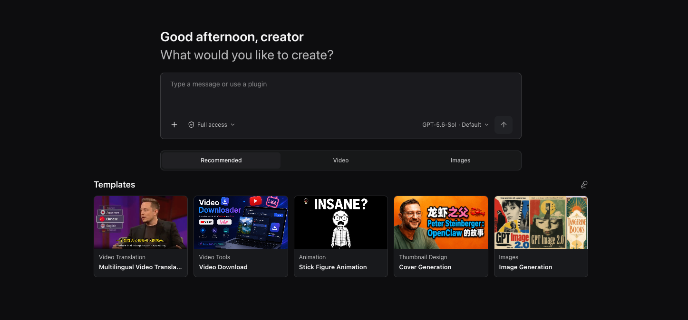

## プロジェクト概要

OpenCreator は、制作や開発の作業をローカル環境で継続的に進めたい個人やチーム向けに設計されています。独自の Agent ループを再実装するのではなく、Codex CLI を実行エンジンとして利用し、その上に安定したローカル Runtime、ビジュアルワークスペース、Desktop ホストを提供します。

OpenCreator には、連携して使える2つの操作方法があります。

- **コンテンツワークスペース**：ビジュアルツールと制作テンプレートを使って、動画翻訳、動画ダウンロード、サムネイル生成、画像生成などの制作を進められます。
- **Agent との対話**：自然言語で制作や開発のタスクを開始・進行し、会話をプロジェクト単位で整理できます。Run をバックグラウンドで継続しながら、承認、添付ファイル、ファイル、Skills、MCP、スケジュール、通知、メモリ、診断を一元管理できます。

Web が唯一のフロントエンド実装です。Desktop は同じ Web ビルドを読み込み、ディレクトリ選択、ウィンドウのライフサイクル、トレイ、ネイティブ通知など、OS が必要な機能だけを追加します。同じデータとコンテンツビューポートを使用する場合、両プラットフォームで共通の UI と Runtime の動作が一致します。

## 主な特徴

- 🤖 **Codex ネイティブ**：別の実行エンジンを保守することなく、Codex の Agent ループ、モデル、推論、ツール呼び出し、会話、Skills、MCP をそのまま活用できます。

- 🚀 **すぐに使える Desktop アプリ**：Codex CLI を同梱した Desktop アプリから OpenCreator を直接起動できます。ローカル Runtime は必要に応じて起動し、デフォルトプロジェクトを自動的に準備します。

- ⚙️ **ローカル Codex 設定を認識**：Desktop の初回起動時に既存の Codex 設定を確認し、利用可能な ChatGPT ログインや API キーを引き継げます。別のモデルプロバイダーもガイドに従って設定できます。

- 🔄 **管理された Runtime コンポーネント**：同梱中、使用中、最新版の yt-dlp を確認し、定期的な更新チェックと手動更新を行えます。更新に失敗した場合も、現在動作しているバージョンを保持します。

- 🎨 **マルチモーダル制作**：動画、画像、音声、字幕、ドキュメントを1つの連携したワークフローで制作・管理できます。

- 🧩 **制作テンプレート**：プロンプトや設定をゼロから用意せずに、再利用できるテンプレートから画像や動画の制作を始められます。

- 🔗 **2つの操作モード**：ビジュアルワークスペースと Agent 会話のどちらからでも作業でき、共通のステートマシンが手順、進捗、結果を同期します。

- 🕘 **バージョン管理**：修正のたびに新しいバージョンを作成し、以前の設定と出力を比較・確認できる状態で保持します。

- 🧩 **再利用可能な Skills**：動画ワークフローの Skills を活用し、独自の Skills で Agent を拡張できます。MCP は Codex ネイティブ設定で管理します。

- 🧠 **メモリ**：グローバル、プロジェクト、スレッド単位のメモリを保持し、要約と再現可能な Run 入力スナップショットを保存します。

- 🔐 **ローカルセキュリティ**：データ、添付ファイル、ログはデフォルトでローカルに保持され、承認と秘匿化された診断情報を利用できます。

## 制作ツール

現行リリースには、6つの制作ツールが含まれています。利用可能なモデルとサービスは、ローカルの Codex 環境および AI サービス設定によって異なります。

Dashboard から、動画翻訳やダウンロード、サムネイル・画像生成、スマート吹き替えによるナレーション制作、Seedance による動画生成を開始できます。

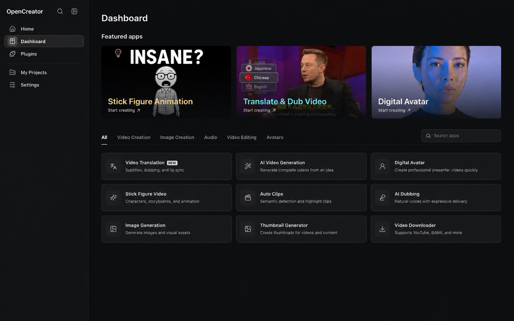

> 制作ツールは今後も順次追加されます。

**動画翻訳は 101 の翻訳先言語に対応しています。**

<table width="100%">
<thead>
<tr>
<th width="18%">制作ツール</th>
<th width="14%">状態</th>
<th width="68%">機能</th>
</tr>
</thead>
<tbody>
<tr><td valign="top">動画翻訳</td><td valign="top">✅ 利用可能</td><td>ローカルまたは公開動画を読み込み、クラウドまたはローカルの Whisper サービスで文字起こしを実行します。LLM のコンテキストを活用して字幕の分割、位置合わせ、用語処理、翻訳を行い、二言語字幕、吹き替えまたはカスタム音声サンプル、字幕スタイル、横向き・縦向きの構成を設定し、SRT、音声、動画として書き出せます</td></tr>
<tr><td valign="top">動画ダウンロード</td><td valign="top">✅ 利用可能</td><td>YouTube、Bilibili、X、TikTok、Instagram、抖音、Facebook、小紅書、Pinterest の公開動画を個別に解析し、利用可能な形式を比較して動画または音声をダウンロードできます。一部のサイトでは Cookie が必要です</td></tr>
<tr><td valign="top">サムネイル生成</td><td valign="top">✅ 利用可能</td><td>テーマ、動画リンク、任意の参照画像を組み合わせ、複数のコンテンツ用サムネイル案を生成して比較できます</td></tr>
<tr><td valign="top">画像生成</td><td valign="top">✅ 利用可能</td><td>プロンプトと任意の参照画像から GPT Image で画像を生成し、アスペクト比と生成枚数を設定して、各画像をプレビュー・ダウンロードできます</td></tr>
<tr><td valign="top">記事作成</td><td valign="top">✅ 利用可能</td><td>トピック、リンク、動画、資料から編集可能なテーマ、構成、記事を作成し、画像を追加して Markdown、HTML、PDF に書き出します。</td></tr>
<tr><td valign="top">小紅書投稿</td><td valign="top">✅ 利用可能</td><td>トピックや資料から、対象読者、投稿形式、長さを指定して投稿を作成し、コピーまたはダウンロードできます。</td></tr>
<tr><td valign="top">ショート動画台本</td><td valign="top">✅ 利用可能</td><td>トピックや資料から、読者、プラットフォーム、長さ、トーンに合わせた撮影用の分割台本を作成・編集・出力できます。</td></tr>
<tr><td valign="top">スティックフィギュアアニメーション</td><td valign="top">✅ 利用可能</td><td>テキストまたは YouTube のコンテンツから、ナレーション、音声、一貫したキャラクターの絵コンテ、字幕、ダウンロード可能なアニメーションを制作できます。</td></tr>
<tr><td valign="top">自動クリップ</td><td valign="top">開発中</td><td>長尺動画を分析して見どころを特定し、選択した場面を再利用可能な短いクリップに仕上げます</td></tr>
<tr><td valign="top">スマート吹き替え</td><td valign="top">✅ 利用可能</td><td>音声、テンポ、感情表現を選び、脚本からナレーションを生成します</td></tr>
<tr><td valign="top">動画生成</td><td valign="top">✅ 利用可能</td><td>Seedance を使用してプロンプトと参照画像から動画を生成し、各バージョンをプレビュー、再生成、ダウンロードできます</td></tr>
<tr><td valign="top">デジタルアバター</td><td valign="top">開発中</td><td>脚本、音声、アバター表現を組み合わせ、トーキングヘッド動画を制作します</td></tr>
</tbody>
</table>

## 制作テンプレート

プロンプトや設定をゼロから作る代わりに、テンプレートから制作を始められます。動画制作や画像デザインなど、カテゴリ別におすすめのテンプレートを探せます。

制作テンプレートには、OpenCreator のオリジナル作品と外部クリエイターの作品が含まれます。第三者のテンプレートには作者を明記し、詳細ページから元の公開元に移動できます。

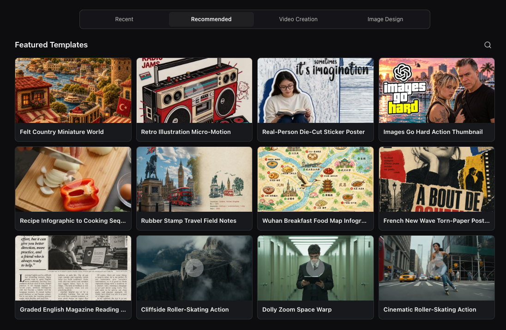

テンプレートを開くと、制作例に加えてプロンプト、設定、タグ、作者、元の公開元を確認できます。**このテンプレートを使用** を選んで制作を始め、必要に応じて入力を調整できます。

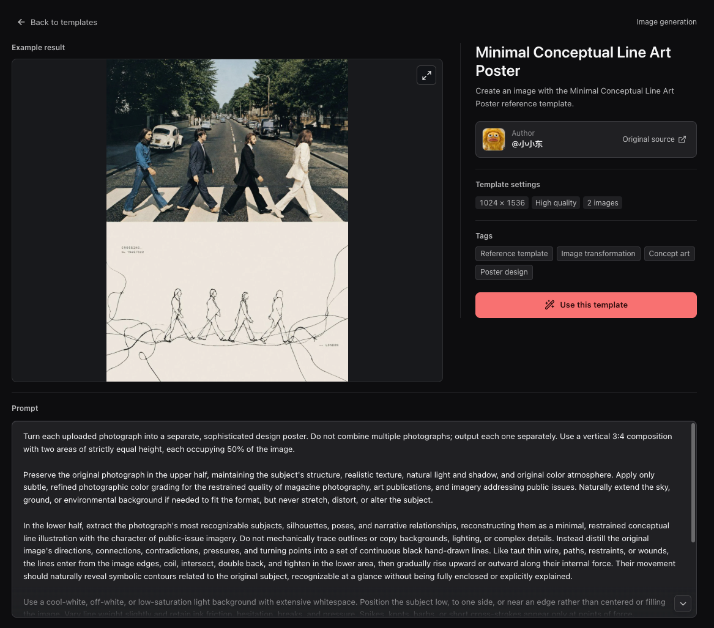

## Skills

制作ツールは視覚的な操作を提供し、Skills は Agent に再利用可能な実行指針とツールのワークフローを提供します。OpenCreator はリポジトリに動画制作 Skills を含み、ローカルの Codex Skills の管理にも対応しています。

リポジトリの [`skills/`](../../skills/) ディレクトリには、内蔵の KrillinAI CLI を操作する Agent 向けの再利用可能な指針が含まれています。

| Skill | 機能 |
| --- | --- |
| [KrillinAI CLI](../../skills/krillinai-cli/SKILL.md) | コマンドの選択、設定の確認、進捗・マニフェスト・出力・エラーの解釈 |
| [字幕生成](../../skills/krillinai-subtitle/SKILL.md) | プラットフォームの字幕取得またはメディアの文字起こし、字幕翻訳、二言語字幕や縦型動画向け短文字幕の生成 |
| [TTS](../../skills/krillinai-tts/SKILL.md) | 字幕から対象言語の吹き替えを生成し、必要に応じて吹き替え動画を作成 |
| [横型レンダリング](../../skills/krillinai-render-horizontal/SKILL.md) | 二言語字幕付き横型動画、または吹き替え音声と対象言語字幕付き動画を生成 |
| [縦型レンダリング](../../skills/krillinai-render-vertical/SKILL.md) | タイトル、二言語字幕、吹き替えを含む縦型動画を合成 |
| [カバー生成](../../skills/krillinai-cover/SKILL.md) | 完成したテキストプロンプトからカバー画像を生成し、画像と最終プロンプトを保存 |
| [パイプライン計画](../../skills/krillinai-pipeline/SKILL.md) | dry-run モードで複数段階の出力計画を検証し、実際の処理は各段階の Skills で個別に実行 |

### 独自の Skills で拡張

OpenCreator は `SKILL.md` で定義されたローカルの Codex Skills に対応しており、固定の制作ツールだけでなく独自の方法やワークフローを追加できます。利用可能な Skills は有効な Codex home とインストール済みの Skills によって異なり、動画ワークフロー Skills には CLI と関連サービスの設定が必要です。リポジトリに含まれていることは、自動インストールやすべての外部サービスの同梱を意味しません。

## 会話とワークスペースを連携して進める

タスクを自然な言葉で伝え、細かな調整が必要になったらビジュアルツールへ移れます。

以下のサービスとモデルは一例です。実際の利用可否は認証情報、サービスのアカウント権限、プラットフォームによって異なります。

### 細かなワークスペース操作

字幕、ショット、音声、生成設定を正確に調整できます。

### 柔軟な会話による編集

変更内容を Agent に伝え、自然な言葉で結果を継続的に改善できます。

### 同期された状態

会話とワークスペースが現在のタスク状態を共有するため、同じ説明を繰り返す必要はありません。

### 独立したバージョン

修正のたびに以前の結果や設定を上書きせず、独立したバージョンを作成します。

## 対応モデル

言語モデルは Codex のモデルカタログ、または設定した OpenAI 互換プロバイダーから利用できます。画像、動画、音声、文字起こしモデルには **設定 → AI サービス** で構成したサービスを使用します。

以下は組み込みのサービス設定と推奨モデルです。実際の利用可否は認証情報、サービスのアカウント権限、プラットフォームによって異なります。

### 言語モデル

<table>
<tr>
<td align="center" width="20%"><br /><strong>GPT</strong></td>
<td align="center" width="20%"><br /><strong>DeepSeek</strong></td>
<td align="center" width="20%"><br /><strong>Qwen</strong></td>
<td align="center" width="20%"><br /><strong>Kimi</strong></td>
<td align="center" width="20%"><br /><strong>GLM</strong></td>
</tr>
<tr>
<td align="center" width="20%"><br /><strong>Grok</strong></td>
<td align="center" width="20%"><br /><strong>Doubao</strong></td>
<td align="center" width="20%"><br /><strong>ERNIE</strong></td>
<td align="center" width="20%"><br /><strong>Hunyuan</strong></td>
<td align="center" width="20%"><br /><strong>MiniMax</strong></td>
</tr>
</table>

### 画像

<table>
<tr>
<td align="center" width="25%"><br /><strong>GPT Image</strong></td>
<td align="center" width="25%">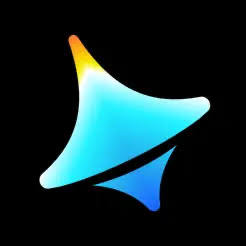<br /><strong>Seedream 4.0</strong><br />Jimeng</td>
<td align="center" width="25%">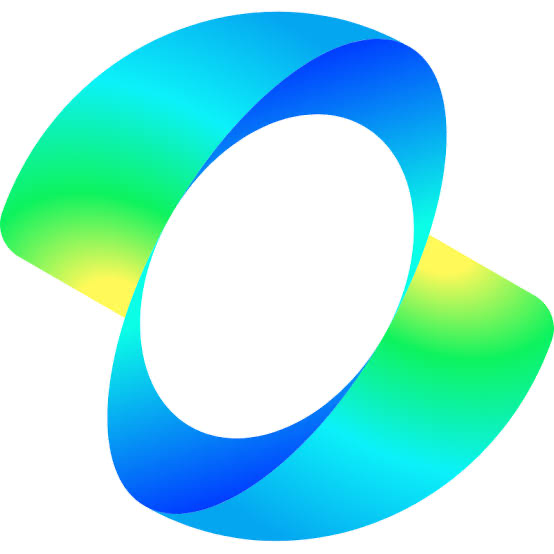<br /><strong>Kling v2.1</strong><br />Kling Image</td>
<td align="center" width="25%">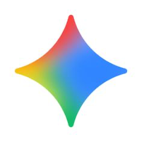<br /><strong>Nano Banana</strong><br />Gemini 2.5 Flash Image</td>
</tr>
</table>

### 動画

<table>
<tr>
<td align="center" width="33%">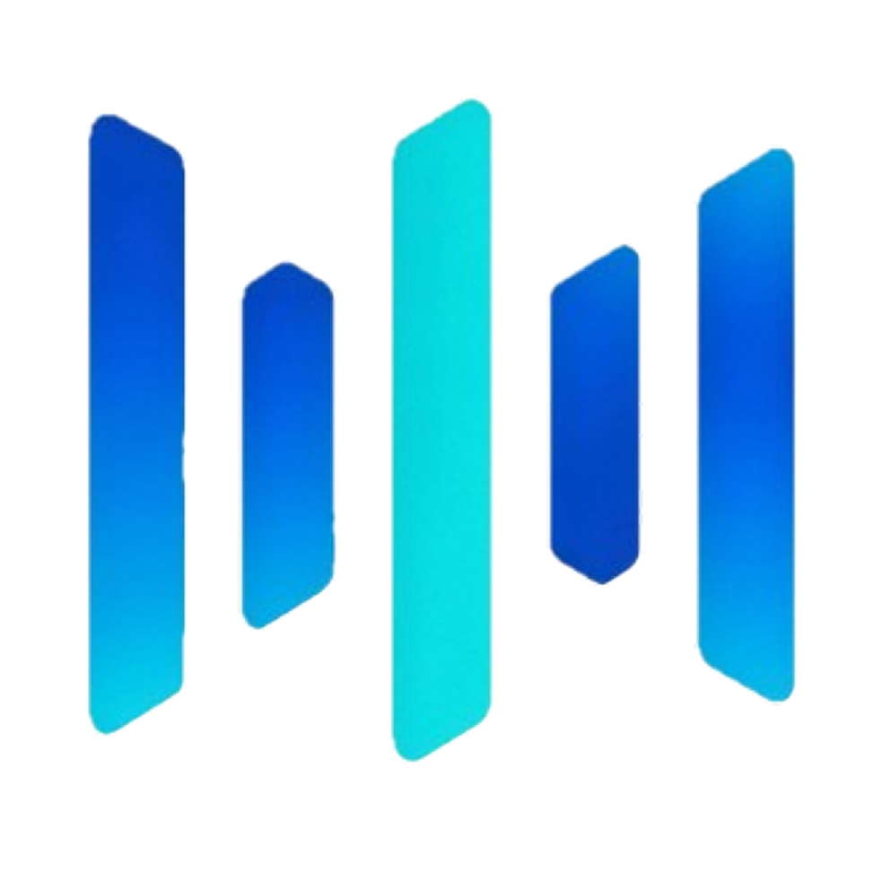<br /><strong>Seedance 2.5</strong></td>
<td align="center" width="33%"><br /><strong>Kling v2.1 Master</strong></td>
<td align="center" width="33%"><br /><strong>Veo 3.1</strong></td>
</tr>
</table>

### 音声と文字起こし

<table>
<tr>
<td align="center" width="16%"><br /><strong>Whisper</strong></td>
<td align="center" width="16%"><br /><strong>OpenAI TTS</strong></td>
<td align="center" width="16%"><br /><strong>MiniMax</strong></td>
<td align="center" width="16%"><br /><strong>Edge TTS</strong></td>
<td align="center" width="16%"><br /><strong>Aliyun Speech</strong></td>
<td align="center" width="16%"><br /><strong>Volcengine Speech</strong></td>
</tr>
</table>

ローカル文字起こしには、対応環境で faster-whisper、WhisperKit、whisper.cpp も使用できます。

## 活用例

### 動画翻訳

以下の公開例は、OpenCreator がまだ KrillinAI という名称だった時期に制作されたものです。字幕の位置合わせ、翻訳、吹き替え、縦向き動画のワークフローを、現在の OpenCreator の動画翻訳ワークスペースがより広範な Agent ワークフローへ統合していることを示しています。

このプロジェクトでは、46分のローカル動画から、字幕を手作業で調整することなく1回の実行で以下の字幕ファイルを生成しました。公開結果では、字幕の欠落や重複がなく、自然な文分割と高品質な翻訳を実現しています。

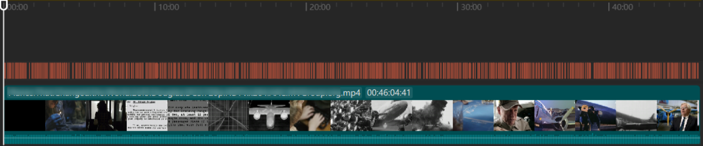

<table width="100%">
<tr>
<td width="33%">

#### 字幕翻訳

https://github.com/user-attachments/assets/bba1ac0a-fe6b-4947-b58d-ba99306d0339

</td>
<td width="33%">

#### 吹き替え

https://github.com/user-attachments/assets/0b32fad3-c3ad-4b6a-abf0-0865f0dd2385

</td>
<td width="33%">

#### 縦向きモード

https://github.com/user-attachments/assets/c2c7b528-0ef8-4ba9-b8ac-f9f92f6d4e71

</td>
</tr>
</table>

> これらの動画例と字幕位置合わせ画像は、OpenCreator が KrillinAI という名称を使用していた時期に制作されました。

### 動画生成

Seedance を使用して、テキストプロンプトまたは参照画像から AI 動画を生成します。モデル、アスペクト比、解像度、長さを設定し、プロジェクトワークスペースで各バージョンのプレビュー、再生成、ダウンロードを行えます。

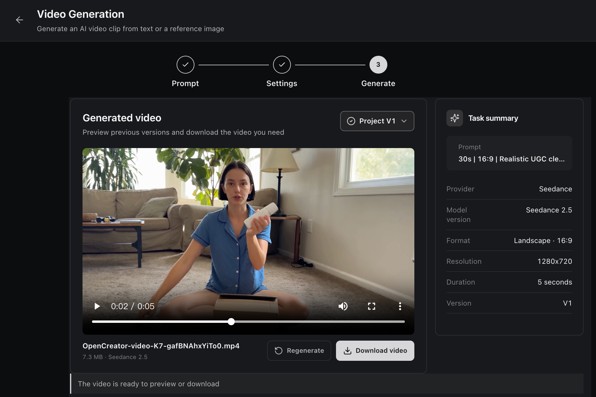

### 動画ダウンロード

公開動画のリンクを解析し、利用可能な形式を比較して、動画または音声をプロジェクトへ直接ダウンロードできます。

対応する動画サイト：

<table align="center">
  <tr>
    <td align="center" width="96"><br /><strong>YouTube</strong></td>
    <td align="center" width="96"><br /><strong>Bilibili</strong></td>
    <td align="center" width="96"><br /><strong>X</strong></td>
    <td align="center" width="96"><br /><strong>TikTok</strong></td>
    <td align="center" width="96"><br /><strong>Instagram</strong></td>
    <td align="center" width="96"><br /><strong>抖音</strong></td>
    <td align="center" width="96"><br /><strong>Facebook</strong></td>
    <td align="center" width="96"><br /><strong>小紅書</strong></td>
    <td align="center" width="96"><br /><strong>Pinterest</strong></td>
  </tr>
</table>

利用できるかどうかは動画や地域によって異なり、一部のサイトでは Cookie が必要な場合があります。OpenCreator はブラウザーの Cookie を自動で読み込みません。

**小紅書の動画投稿：**公開されている `https://www.xiaohongshu.com/explore/<24桁の16進数の投稿ID>` の完全な URL を貼り付けてください。`xsec_token` などのクエリパラメーターも残してください。画像のみの投稿には動画形式がなく、プロフィールと `xhslink.com` の短縮リンクには対応していません。トークンの期限切れやアクセス制限などによりダウンロードできない場合があります。

**Pinterest の動画 Pin：**公開されている `https://www.pinterest.com/pin/<数字のID>/` を貼り付けてください。画像のみの Pin、ボード、プロフィールには対応していません。

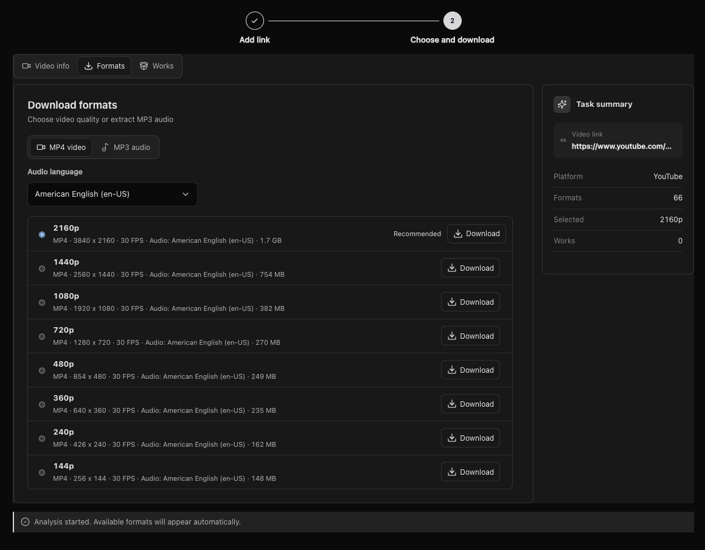

### スティックフィギュアアニメーション

OpenCreator は、[Stickman on Behance](https://www.behance.net/gallery/254715463/Stickman) の作者であるアーティスト [Harbor Hsia](https://www.behance.net/xiaheyuan1) と共同で、このオリジナルキャラクターコレクションを開発しました。内蔵のキャラクターにより、アニメーション制作を通じて一貫した人物像を保てます。

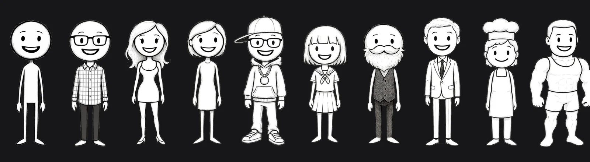

テキストや YouTube コンテンツから、脚本の確認、ナレーション、タイミング調整、絵コンテ、字幕、レンダリングを経て、ダウンロードできるアニメーションを制作します。


## クイックスタート

### Desktop アプリをインストール

[最新リリース](https://github.com/krillinai/OpenCreator/releases/latest)から macOS Apple Silicon、macOS Intel、Windows x64 用のインストーラーをダウンロードしてください。Desktop アプリに Node.js と pnpm は不要で、Codex CLI が同梱されています。実際のモデルタスクには利用可能な ChatGPT ログインまたは API キー設定が必要です。

初回起動時にローカル Runtime が起動し、デフォルトプロジェクトを準備して、ローカルの Codex 設定を確認します。利用可能なログイン情報または API キーとモデル設定が見つかった場合は、**ローカル Codex を使用して続行**を選んで引き継げます。同じ初期設定画面で別のモデルプロバイダーを設定することもできます。

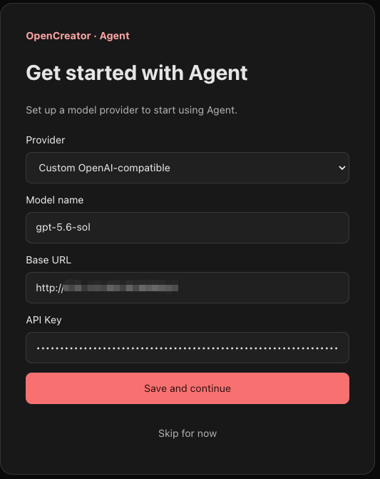

設定後、入力欄からタスクを開始できます。問題がある場合は[ユーザーガイド](../opencreator-user-guide-and-troubleshooting.md)を参照してください。

### ソースから Web を起動

開発またはブラウザで使用するには、以下を用意してください。

- Node.js 22 以降
- リポジトリの `packageManager` フィールドで固定されている pnpm 9.15.0
- ターミナルから実行可能な Codex CLI
- 実際のモデルタスクを実行するための有効な Codex CLI ログイン

まずローカル環境を確認します。

```bash
node --version
pnpm --version
codex --version
```

```bash
git clone https://github.com/krillinai/OpenCreator.git
cd OpenCreator
corepack enable
pnpm install
pnpm web:dev
```

`http://127.0.0.1:19861/` を開きます。開発サーバーは必要に応じてローカル daemon を起動し、同一オリジンのプロキシを通じて一時的な Runtime トークンを注入するため、接続トークンを手動でコピーする必要はありません。

初回起動時に Runtime がデフォルトプロジェクトを準備します。接続が完了すると、すぐに入力欄を使用できます。daemon のみを操作する場合は、次を実行します。

```bash
pnpm daemon:dev
```

daemon はローカルのループバックアドレスだけをリッスンし、接続アドレスと一時トークンを標準出力へ一度だけ表示します。

## Desktop

Desktop とブラウザ版は、`apps/web` にある同じ React フロントエンドを使用します。プロジェクト、会話、タスク、設定などの共通機能は、同じ Daemon/API を呼び出します。Electron は実際のシステムパス、ウィンドウ操作、トレイ、ネイティブ通知だけを追加します。

### 開発モード

```bash
pnpm desktop:dev
```

### ローカルパッケージング

| コマンド | 出力 |
| --- | --- |
| `pnpm desktop:package` | 現在のプラットフォーム向けの実行可能ディレクトリ。ローカル検証用 |
| `pnpm desktop:dist` | 現在のプラットフォーム向けインストーラー |
| `pnpm desktop:release` | 正式リリース用パッケージングのエントリーポイント |
| `pnpm --filter @opencreator/desktop verify:package` | 既存の Desktop パッケージを検証 |

Desktop のパッケージングでは、現在のワークスペースから Web を再ビルドし、コミット、dirty 状態、プラットフォーム、アーキテクチャ、Web ハッシュを記録したうえで、`apps/web/dist` とアプリケーション内のリソースを比較します。一致しない場合、パッケージングは失敗します。署名、公証、Windows ビルド、リリース要件については、[Desktop リリース運用ガイド](../operations/opencreator-desktop-release-runbook.md)を参照してください。

## コアワークフロー

### 会話と Run

1. プロジェクトを選択するか、新しい会話を開始します。
2. タスクを入力し、権限レベル、Profile、モデル、推論強度を選択します。
3. Run の実行中は、後続タスクをキューに追加するか、現在の処理を中断してすぐに続行できます。
4. Timeline で推論の要約、ツール呼び出し、ファイル変更、承認、最終結果を確認します。
5. タスクセンターで、実行中、完了、失敗、承認待ちのタスクを一元的に追跡します。

### Skills と MCP

- プラグインセンターで Skill マーケットプレイス、インストール履歴、ローカルで利用可能な Skills を閲覧できます。
- 入力欄で `/` または追加メニューから Skill を選択すると、次のタスクがそのワークフローに従います。
- MCP の管理は、別の実行エンジンを保守するのではなく、Codex ネイティブのコマンドと設定を利用します。
- OpenCreator はデフォルトで現在の `$CODEX_HOME` を使用するため、グローバルな Skills や MCP の設定を変更する前に影響範囲を確認してください。

### スケジュールと専用タスクスレッド

- 各スケジュールは、永続的な専用 OpenCreator 会話を持ちます。
- 自動トリガー、手動実行、ユーザーのフォローアップは同じ会話を再利用し、`queue` または `skip` ポリシーに従って直列実行されます。
- スケジュールを削除すると専用会話はアーカイブされますが、既存の Runs、結果、基盤となる Codex 履歴は保持されます。
- 基盤となる Codex スレッドのローテーションや復旧が行われても、OpenCreator のタスクエントリーやページルートは変わりません。

## OpenCreator システム構成

OpenCreator は、ビジュアルワークスペースと Agent 会話を別々のワークフローではなく、同じ制作タスクに対する2つのインターフェースとして扱います。各制作ワークフローはステートマシンとしてモデル化され、素材入力、設定、生成、確認、修正、書き出しが明確な状態とイベントになります。ワークスペースの操作と会話コマンドは同じステートマシンへ入り、現在の手順、設定、進捗、バージョン、結果が両方のインターフェースへ反映されます。これにより、別の情報源を増やすことなくワークスペースと会話を同期できます。

制作は反復的な作業であるため、修正によって現在の結果が上書きされることはありません。修正または再生成のたびに既存のワークフロー状態から新しいバージョンを作成し、以前の設定と出力を確認、比較、継続的に改善できる状態で保持します。

```text
+-----------------------------+     +------------------------------------+
| Browser Access              |     | Desktop Host                       |
|                             |     | Shared Web build + Electron        |
+--------------+--------------+     +------------------+-----------------+
               |                                       |
               +-------------------+-------------------+
                                   v
+----------------------------------------------------------------------------+
| Creator Experience / apps/web                                              |
| Dashboard / Creator Tools / Agent Conversation / Settings / Files          |
+-------------------------------------+--------------------------------------+
                                      |
+-------------------------------------v--------------------------------------+
| Collaboration Core                                                         |
| Shared workflow state / Steps / Progress / Results / Versions              |
+-------------------------------------+--------------------------------------+
                                      | Runtime API + SSE
+-------------------------------------v--------------------------------------+
| Local Runtime / apps/daemon                                                 |
| Projects / Runs / Approvals / Schedules / Memory / Notifications           |
| Component status / Update checks / Verified updates / Safe fallback        |
+-------------+------------------------+------------------------+-------------+
              |                        |                        |
              v                        v                        v
+---------------------+  +---------------------+  +-------------------------+
| Local Data          |  | Codex Engine        |  | Media Toolchain         |
| SQLite / Files      |  | CLI / app-server    |  | FFmpeg / yt-dlp         |
| System credentials  |  | Skills / MCP        |  | Whisper / AI services   |
+---------------------+  +---------------------+  +-------------------------+
```

| OpenCreator コンポーネント | 役割 | 実装 |
| --- | --- | --- |
| 制作体験 | Dashboard、制作ツール、Agent 会話、設定、ファイルを提供 | `apps/web` · React 18 · Vite · TypeScript |
| コラボレーションコア | ワークスペースの手順、会話コンテキスト、進捗、結果、修正履歴を同期 | 共通ワークフロー状態 · `CreatorCollaborationPanel` · バージョン履歴 |
| ローカル Runtime | プロジェクト、Runs、承認、スケジュール、メモリ、通知を管理 | `apps/daemon` · Fastify · Runtime API · SSE |
| Runtime コンポーネント | 同梱中、使用中、最新版を追跡し、定期確認とユーザー指定の更新のみを実行 | yt-dlp nightly · 更新検証 · 動作中バージョンへのフォールバック |
| Codex エンジン | Agent ループ、セッション、推論、ツール、Skills、MCP を提供 | Codex CLI · app-server |
| メディアツールチェーン | クリエイティブメディアをダウンロード、文字起こし、変換、生成、書き出し | yt-dlp · Whisper · FFmpeg · 設定済み AI サービス |
| ローカルデータ | プロジェクトデータ、Runs、添付ファイル、出力、認証情報をローカルに保存 | SQLite · ファイルシステム · システム認証情報ストレージ |
| Desktop ホスト | 共通 Web ビルドを読み込み、OS 固有機能を追加 | `apps/desktop` · Electron · Preload Bridge |

基本原則：

- ワークスペースと Agent 会話は、同じワークフロー状態を同期して表示します。両方が同じステートマシンへイベントを送り、別々のタスク状態を持ちません。
- 修正時は既存の結果を置き換えずに新しいバージョンを作成し、各制作イテレーションのコンテキストと出力を保持します。
- フロントエンドは Codex を直接起動せず、Codex の生の JSONL イベント形式にも依存しません。
- daemon がプロセスのライフサイクル、イベントの正規化、永続化、承認、スケジュール、通知 outbox を管理します。
- Agent ループ、Skills、MCP の実行において、Codex が引き続き唯一の信頼できる情報源です。
- Browser Bridge と Desktop Bridge が汎用製品ロジックを別々に実装することはありません。

## リポジトリ構成

```text
OpenCreator/
├── apps/
│   ├── web/          # 唯一の React フロントエンド実装
│   ├── daemon/       # ローカル Fastify Runtime と Codex アダプター
│   ├── desktop/      # Electron Main、Preload、ネイティブ機能、パッケージング
│   └── harness/      # Runtime コマンドライン検証ツール
├── packages/
│   ├── protocol/     # Web、Daemon、Desktop で共有する Runtime 契約
│   └── skill-market/ # Skill マーケットプレイスのモデルと共通ロジック
├── docs/             # 設計、API リファレンス、運用ガイド、テストレポート
├── scripts/          # リポジトリレベルのチェック
└── .runtime/         # 初回起動時に作成されるローカル Runtime データ
```

## 設定

### AI サービスの API キー

**Settings → AI Services** を開き、現在のワークスペースで使用するモデル、文字起こし、音声、画像プロバイダーを設定します。今後追加予定の制作ツールに備えて、追加のサービスカテゴリが表示される場合があります。各カテゴリには、選択したプロバイダーに必要な Base URL、API Key、モデル、プロキシ、プロバイダー固有の認証情報だけが表示されます。

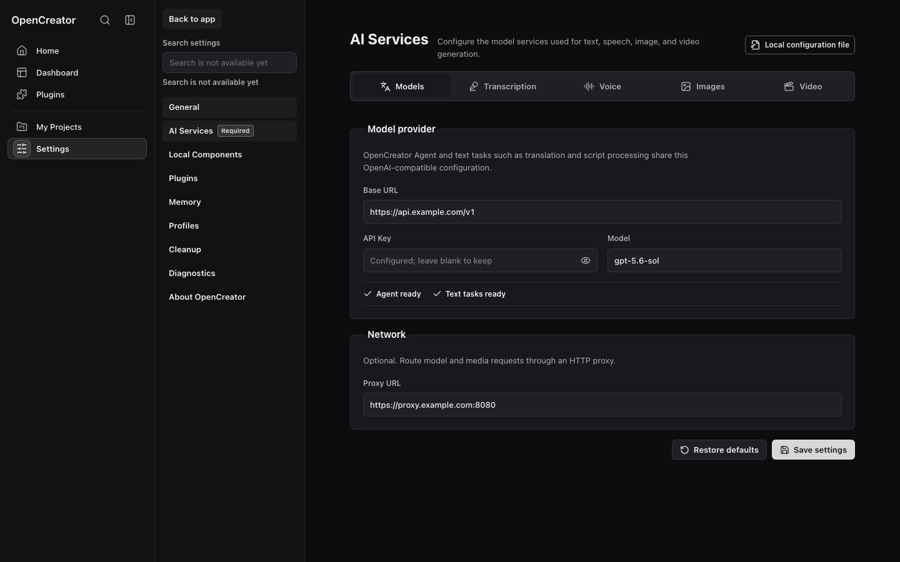

認証情報はローカル Runtime のシステム認証情報ストレージに保存され、リポジトリへコミットしてはいけません。Edge TTS など、一部のローカルまたはシステムベースのプロバイダーでは API Key は不要です。

### サードパーティ Runtime コンポーネント

**設定 → サードパーティコンポーネント** を開くと、現在使用中の yt-dlp nightly バージョン、OpenCreator に同梱されたバージョン、その取得元、利用可能な最新版を確認できます。OpenCreator は7日ごとに更新を確認しますが、自動インストールは行いません。更新には明示的なユーザー操作が必要で、ダウンロード、検証、インストールに失敗した場合も現在動作しているバージョンを継続して使用できます。

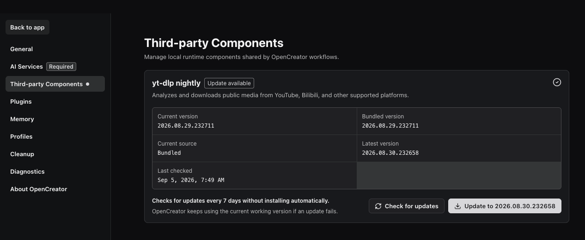
### Runtime 環境変数

ほとんどのユーザーは環境変数を設定する必要はありません。データを分離したい場合、特定の Codex 実行ファイルを使用したい場合、または管理対象プロジェクトのディレクトリを変更したい場合に使用します。

| 環境変数 | デフォルト | 用途 |
| --- | --- | --- |
| `OPENCREATOR_DATA_DIR` | `.runtime` | OpenCreator のデータベース、Runs、添付ファイル、管理対象ワークスペース |
| `OPENCREATOR_CODEX_BIN` | `codex` | Codex CLI 実行ファイルのパス |
| `CODEX_HOME` | `~/.codex` | Codex セッション、設定、Skills、MCP、Profiles の信頼できる情報源 |
| `OPENCREATOR_DEFAULT_CWD` | 現在の作業ディレクトリ | daemon のデフォルト作業ディレクトリ |
| `OPENCREATOR_DEFAULT_PROJECT_ROOT` | Runtime のデフォルトポリシー | 管理対象プロジェクトのルート。設定した場合、OpenCreator はその配下の `OpenCreator/` ディレクトリを使用します |
| `OPENCREATOR_CODEX_THREAD_ROTATION_RUN_THRESHOLD` | `50` | 長時間実行スケジュールの背後にある Codex スレッドをローテーションする終端 Run 数のしきい値。`0` で予防的ローテーションを無効化します |

Runtime データと Codex 環境の両方を分離する例：

```bash
OPENCREATOR_DATA_DIR=/path/to/opencreator-data \
CODEX_HOME=/path/to/codex-home \
pnpm web:dev
```

## データとセキュリティ

Runtime データは、デフォルトでリポジトリルートの `.runtime/` に保存されます。

| パス | 内容 |
| --- | --- |
| `.runtime/app.sqlite` | プロジェクト、スレッド、Runs、イベント、スケジュール、通知、添付ファイルのメタデータ、承認、メモリ、要約 |
| `.runtime/runs/` | 各 Run の秘匿化されたログ、診断、メタデータ |
| `.runtime/attachments/` | 管理された添付ファイル |
| `.runtime/workspaces/` | Runtime が管理するプロジェクトワークスペース |

Codex のセッションと設定は引き続き `$CODEX_HOME` に保存されるため、`.runtime/` とは別にバックアップする必要があります。

セキュリティ境界：

- daemon は `127.0.0.1` だけをリッスンし、ヘルスチェックを除くすべての API で Bearer トークンを要求します。
- HTML プレビューでは、スクリプト、ナビゲーション、ポップアップをデフォルトで無効化し、管理された同一ワークスペース内の相対リソースだけを許可します。
- 機密メモリには2回目の確認が必要です。OpenCreator が未確認の提案を自動的かつ永続的に保存することはありません。
- 診断情報と Run ログは、返却またはエクスポートされる前に秘匿化されます。
- Desktop パッケージは ASAR の整合性と Cookie 暗号化を有効にし、RunAsNode、`NODE_OPTIONS`、Node CLI Inspector を無効化します。

バックアップ、復元、クリーンアップ、リセットの詳細は、[ユーザーガイドとトラブルシューティング](../opencreator-user-guide-and-troubleshooting.md)を参照してください。

## 開発

### よく使うコマンド

| コマンド | 用途 |
| --- | --- |
| `pnpm web:dev` | Web を起動し、必要に応じてローカル daemon を起動 |
| `pnpm daemon:dev` | daemon のみを起動 |
| `pnpm desktop:dev` | 依存関係をビルドして Electron を開発モードで起動 |
| `pnpm test` | ワークスペースのユニットテストと統合テストを実行 |
| `pnpm typecheck` | リポジトリ全体の TypeScript チェックを実行 |
| `pnpm build` | すべての workspace をビルド |
| `pnpm e2e` | Web の Playwright E2E テストを実行 |
| `pnpm smoke:ci` | fake Codex Runtime スモークテストを実行 |
| `pnpm perf:check` | 記録済みのパフォーマンス基準を確認 |

提出前に[貢献ガイド](../../CONTRIBUTING.md#what-reviewers-check)に従い影響範囲に応じた検証を選択してください。文書・文言・スタイルの変更は関連する確認のみ、共通処理や Runtime の変更は対象モジュールのテストと型チェックが必要です。全体テストやビルドは必要な場合に実行し、実施した検証を PR に記載してください。

Desktop、Host Bridge、Runtime プロキシ、または共通フロントエンドワークフローを変更した場合は、Web/Desktop 整合性テスト、パッケージ済みアプリの E2E、Web ビルドハッシュの検証も必要です。Web のユニットテストに合格しただけでは、Desktop をリリースできることの証明にはなりません。

実際の Codex スモークテストはデフォルトで無効です。明示的に有効化するには、次を実行します。

```bash
OPENCREATOR_RUN_REAL_CODEX_SMOKE=1 \
pnpm --filter @opencreator/daemon test -- test/smoke/real-codex-smoke.test.ts
```

## ドキュメント

- **OpenCreator を使う:** [クイックスタート](#クイックスタート) · [ユーザーガイドとトラブルシューティング](../opencreator-user-guide-and-troubleshooting.md)
- **開発と拡張:** [貢献ガイド](../../CONTRIBUTING.md) · [Skill の追加](../contributing/skills-contributing.md) · [制作テンプレートの追加](../contributing/templates-contributing.md) · [Runtime API v1](../runtime-api-for-ui-v1.md) · [ビジュアルコンポーネントガイドライン](../visual-component-guidelines.md)
- **保守とリリース:** [Codex ネイティブ Runtime 設計](../2026-07-03-codex-native-agent-runtime-design.md) · [Desktop リリース運用ガイド](../operations/opencreator-desktop-release-runbook.md) · [Windows Desktop リリースガイド](../operations/opencreator-desktop-windows-release.md)

## 翻訳方針

ルートの `README.md` を正本となる英語ドキュメントとします。保守対象の翻訳は `docs/<locale>/README.md` に配置します。英語版と同じ構成ですべての内容を翻訳・同期した後にのみ、言語切り替えへ追加してください。

## コミュニティ

<p>OpenCreator は<strong>少なくとも99の国と地域</strong>の GitHub ユーザーから Star を獲得しています。</p>

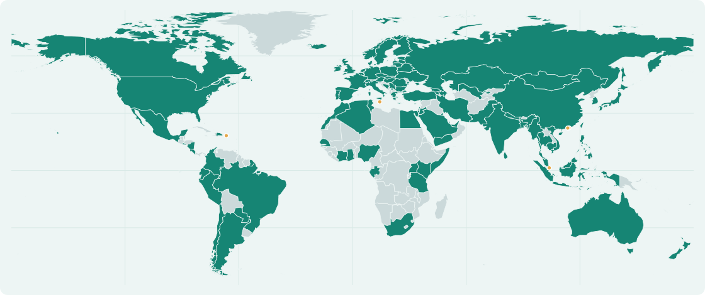

### チーム

各メンバーは担当領域の基準、貢献のレビューとマージ、コミュニティサポートを担います。

<table border="1" cellpadding="12">
  <tr>
    <td align="center" valign="middle" width="160" height="160"><br /><a href="https://github.com/wulien">wulien</a><br />コードとバグ修正</td>
    <td align="center" valign="middle" width="160" height="160"><br /><a href="https://github.com/DLe-kb">DLe-kb</a><br />制作テンプレート</td>
    <td align="center" valign="middle" width="160" height="160"><br /><a href="https://github.com/xiaheyuan">xiaheyuan</a><br />デザインと素材</td>
    <td align="center" valign="middle" width="160" height="160"><br /><a href="https://github.com/krillinai">krillinai</a><br />Skills と文書</td>
    <td align="center" valign="middle" width="160" height="160"><br /><a href="https://github.com/hbxugang">hbxugang</a><br />エンタープライズ向けデプロイ</td>
  </tr>
</table>

### コントリビューター

本プロジェクトにコード、ドキュメント、フィードバック、Issue、Skills、デザイン、アイデアで参加してくださったすべての方に感謝します。

<div>
  <a href="https://github.com/maranello-o"></a>
  <a href="https://github.com/wulien"></a>
  <a href="https://github.com/puji4810"></a>
  <a href="https://github.com/krillinai"></a>
  <a href="https://github.com/PairZhu"></a>
  <a href="https://github.com/Mijaelx"></a>
  <a href="https://github.com/OutisLi"></a>
  <a href="https://github.com/yeager"></a>
  <a href="https://github.com/catwithtudou"></a>
  <a href="https://github.com/newdee"></a>
  <a href="https://github.com/scwf"></a>
  <a href="https://github.com/xiaheyuan"></a>
  <a href="https://github.com/hbxugang"></a>
  <a href="https://github.com/kapil971390"></a>
  <a href="https://github.com/octo-patch"></a>
  <a href="https://github.com/yuanjinghh"></a>
  <a href="https://github.com/DLe-kb"></a>
  <a href="https://github.com/liupig"></a>
  <a href="https://github.com/alextavares" title="alextavares"></a>
  <a href="https://github.com/krillinai/OpenCreator/commit/a89cff0ac5d91540f03e361af50b286ee57691ae" title="卡皮巴拉"></a>
  <a href="https://github.com/mifan100g" title="mifan100g (米饭二两)"></a>
  <a href="https://github.com/askalf"></a>
  <a href="https://github.com/Yi-111-a"></a>
</div>

### コントリビューション

コード以外にも、さまざまな形で OpenCreator に貢献できます：

| 種類 | 貢献内容 | 準備するもの | 提出先 |
| --- | --- | --- | --- |
| コード | 不具合修正、制作フローや共通機能の改善 | 対象を絞った変更、デモまたは再現手順、関連テスト | [Issue][contribute-issue] → [PR][contribute-pr]；`apps/web/` または `apps/daemon/` |
| Skills | 再利用可能な Agent ワークフロー | `SKILL.md`、前提条件、使用例 | [Issue][contribute-issue] → `skills/` の [PR][contribute-pr] |
| 制作テンプレート | 再利用可能な画像・動画・カバーテンプレート | `template.json`、カバーと制作例の素材、プロンプト、設定、出典、使用権 | [`template/`](../../template/) に [PR][contribute-pr] を提出。新形式は [Issue][contribute-issue] で相談 |
| イラスト・デザイン | オリジナルのイラスト、アイコン、UI | プレビュー、編集可能な元データ、ライセンス | [Issue][contribute-issue] → 保存先を決めて [PR][contribute-pr] |
| 外部サービス連携 | AI・メディアサービスの対応 | 用途、設定、エラー処理、認証情報の保護、テスト | [Issue][contribute-issue] → Web / Daemon の [PR][contribute-pr] |

各テンプレートと素材は `template/<module>/<id>/<version>/template.json` に配置します。現在のモジュールは `image-generation`、`video-generation`、`cover-generator` です。タイトルと説明は中国語・英語の両方を用意し、PR 前に `pnpm templates:validate` を実行してください。

参加方法：

1. [Issues](https://github.com/krillinai/OpenCreator/issues) に問題、ユースケース、期待する動作を記載してください。
2. 最新の開発ブランチから、目的を絞った機能追加または修正ブランチを作成してください。
3. 既存のアーキテクチャに従い、汎用製品機能は Web と Daemon に一度だけ実装し、ネイティブ固有の差異は明示的な capability の背後へ分離してください。
4. 動作変更に応じたユニット、統合、E2E テストを追加し、Pull Request に実施済みと未実施の検証を明記してください。
5. `.runtime/`、ローカル認証情報、Codex セッション、ビルドキャッシュ、その他のユーザーデータをコミットしないでください。

[contribute-issue]: https://github.com/krillinai/OpenCreator/issues
[contribute-pr]: https://github.com/krillinai/OpenCreator/pulls

## Star 履歴

OpenCreator の旧称は KrillinAI です。このグラフには、名称変更前後を含むリポジトリ全体の履歴が表示されます。

[](https://www.star-history.com/?type=date&repos=krillinai%2FOpenCreator)

## 関連プロジェクト

| プロジェクト | 役割 |
| --- | --- |
| [OpenAI Codex](https://github.com/openai/codex) | モデルアクセス、推論、ツール呼び出し、セッション、Skills、MCP 連携を支える Agent 実行エンジンです。 |
| [yt-dlp](https://github.com/yt-dlp/yt-dlp) | 対応する公開メディアリンクを解析し、利用可能な形式を一覧表示して、制作ワークフロー用の動画や音声をダウンロードします。 |
| [FFmpeg](https://ffmpeg.org/) | FFmpeg と ffprobe がメディア変換、合成、フレーム抽出、出力検証を処理します。 |
| [Whisper](https://github.com/openai/whisper)、[whisper.cpp](https://github.com/ggml-org/whisper.cpp)、[faster-whisper](https://github.com/SYSTRAN/faster-whisper)、[WhisperKit](https://github.com/argmaxinc/WhisperKit) | Runtime で利用可能な機能に応じて選択する、クラウドおよび各プラットフォーム向けのローカル音声文字起こし手段です。 |
| [React](https://react.dev/) | Web と Desktop で共有するユーザーインターフェースの基盤です。 |
| [Fastify](https://fastify.dev/) | ローカル Runtime の HTTP と API の基盤です。 |
| [Electron](https://www.electronjs.org/) | ネイティブなシステム機能、アプリのライフサイクル、パッケージングを担う Desktop ホストです。 |
| [SQLite](https://www.sqlite.org/) | プロジェクト、会話、Runs、スケジュール、メモリなどのワークスペースデータをローカルに保存します。 |
| [Model Context Protocol](https://modelcontextprotocol.io/) | 外部ツールやサービスを Agent ワークスペースへ接続するためのオープンプロトコルです。 |

---

<div align="center">

**OpenCreator · ローカルで制作し、継続的に取り組む。**

</div>
