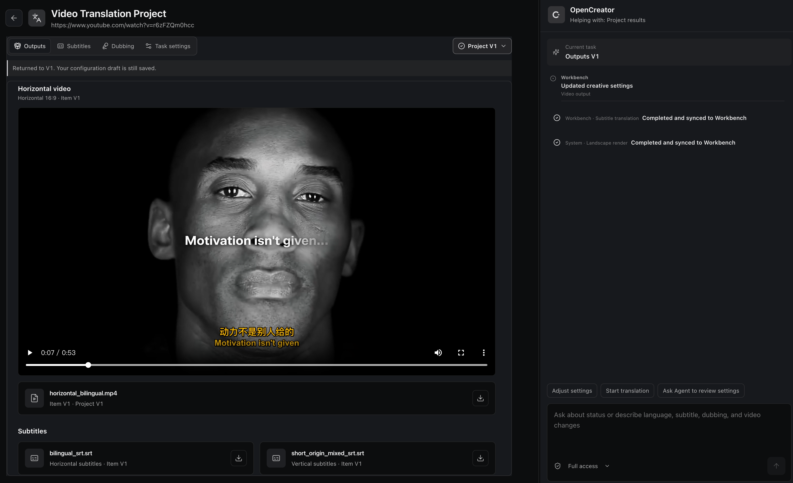

<div align="center">

<h1>
  <picture>
    <source media="(prefers-color-scheme: dark)" srcset="../images/OpenCreator_logo_vector_dark.svg" />
    
  </picture>
  <br />
  พื้นที่ทำงาน AI แบบโอเพนซอร์สและ Skills สำหรับครีเอเตอร์
</h1>

<p>รวมเครื่องมือสร้างสรรค์แบบภาพ Skills ที่ใช้ซ้ำได้ และ Agents สำหรับงานเขียนสคริปต์ วิดีโอ รูปภาพ เสียง อวตาร การแปล และการตัดต่อไว้ในพื้นที่ทำงานเดียว</p>

<p><strong>OpenCreator เดิมใช้ชื่อ KrillinAI</strong></p>

<a href="https://trendshift.io/repositories/13360" target="_blank"></a>

[English](../../README.md) | [简体中文](../zh/README.md) | [日本語](../ja/README.md) | [한국어](../ko/README.md) | [Bahasa Indonesia](../id/README.md) | [Español](../es/README.md) | [Français](../fr/README.md) | [Deutsch](../de/README.md) | [Português](../pt/README.md) | [Русский](../ru/README.md) | [العربية](../ar/README.md) | **ภาษาไทย**

[](https://github.com/krillinai/OpenCreator/stargazers)
[](https://www.apache.org/licenses/LICENSE-2.0)
[](https://space.bilibili.com/242124650)
[](https://atomgit.com/krillinai/OpenCreator)
[](https://discord.gg/3GwBGsjs8)
[](https://qm.qq.com/q/W4YC0PLMeA)

[จุดเด่น](#จุดเด่นของโครงการ) · [เครื่องมือสร้างสรรค์](#เครื่องมือสร้างสรรค์) · [Skills](#skills) · [ตัวอย่าง](#ตัวอย่าง) · [เริ่มต้นใช้งาน](#เริ่มต้นใช้งาน) · [Desktop](#desktop) · [เอกสาร](#เอกสาร) · [ชุมชน](#ชุมชน)

</div>


## ภาพรวมโครงการ

OpenCreator สร้างขึ้นสำหรับบุคคลและทีมที่ต้องการทำงานสร้างสรรค์และพัฒนาซอฟต์แวร์บนเครื่องของตนอย่างต่อเนื่อง โดยใช้ Codex CLI เป็นกลไกประมวลผล Agent แทนการสร้าง Agent loop ขึ้นใหม่ พร้อมเพิ่ม Runtime ภายในเครื่องที่เสถียร พื้นที่ทำงานแบบภาพ และแอป Desktop

OpenCreator มีรูปแบบการทำงานที่เชื่อมต่อกันสองแบบ:

- **พื้นที่ทำงานเนื้อหา**: ใช้เครื่องมือแบบภาพและเทมเพลตเพื่อแปลและดาวน์โหลดวิดีโอ สร้างภาพและวิดีโอ พากย์เสียง เขียนบทความและโพสต์โซเชียล เขียนสคริปต์วิดีโอสั้น และสร้างแอนิเมชันตัวละครเส้น
- **การสนทนากับ Agent**: เริ่มและกำกับงานสร้างสรรค์หรืองานพัฒนาด้วยภาษาธรรมชาติ จัดการบทสนทนาตามโครงการ ให้ Runs ทำงานเบื้องหลัง และจัดการการอนุมัติ ไฟล์แนบ ไฟล์ Skills, MCP, งานตามกำหนดการ การแจ้งเตือน ความจำ และข้อมูลวินิจฉัยในที่เดียว

Web เป็นการพัฒนาส่วนหน้าเพียงชุดเดียว Desktop โหลด Web build เดียวกันและเพิ่มเฉพาะความสามารถที่ต้องอาศัยระบบปฏิบัติการ เช่น การเลือกไดเรกทอรี วงจรชีวิตหน้าต่าง ถาดระบบ และการแจ้งเตือนแบบเนทีฟ เมื่อใช้ข้อมูลและขนาดพื้นที่แสดงเนื้อหาเท่ากัน ทั้งสองแพลตฟอร์มจะใช้ UI ทั่วไปและพฤติกรรม Runtime เดียวกัน

## จุดเด่นของโครงการ

- 🤖 **ใช้ Codex โดยตรง**: ใช้ Agent loop โมเดล การให้เหตุผล การเรียกใช้เครื่องมือ บทสนทนา Skills และ MCP ของ Codex โดยไม่ต้องดูแลกลไกประมวลผลอีกชุด
- 🚀 **แอป Desktop พร้อมใช้**: เปิด OpenCreator จากแอป Desktop ที่มี Codex CLI รวมอยู่แล้ว Runtime ภายในเครื่องเริ่มตามต้องการและเตรียมโครงการเริ่มต้นให้อัตโนมัติ
- ⚙️ **ตรวจพบการตั้งค่า Codex ในเครื่อง**: เมื่อเปิด Desktop ครั้งแรก แอปจะตรวจการตั้งค่า Codex ที่มีอยู่และเสนอให้ใช้การเข้าสู่ระบบ ChatGPT หรือ API key ที่พร้อมใช้งานต่อได้ รวมทั้งตั้งค่าผู้ให้บริการโมเดลรายอื่นผ่านขั้นตอนเริ่มต้นได้
- 🔄 **จัดการคอมโพเนนต์ Runtime**: ตรวจสอบเวอร์ชัน yt-dlp ที่รวมมา ที่ใช้งานอยู่ และล่าสุด ตรวจอัปเดตเป็นระยะ และอัปเดตด้วยตนเอง โดยเก็บเวอร์ชันที่ใช้งานได้ไว้หากอัปเดตล้มเหลว
- 🎨 **สร้างสรรค์หลายสื่อ**: สร้างและจัดการวิดีโอ รูปภาพ เสียง คำบรรยาย และเอกสารผ่านเวิร์กโฟลว์ที่เชื่อมต่อกัน
- 🧩 **เทมเพลตสร้างสรรค์**: เริ่มสร้างภาพและวิดีโอจากเทมเพลตที่ใช้ซ้ำได้ โดยไม่ต้องตั้งค่าพรอมป์และตัวเลือกทั้งหมดใหม่
- 🔗 **เวิร์กโฟลว์สองรูปแบบ**: ทำงานผ่านพื้นที่ทำงานแบบภาพหรือสนทนากับ Agent โดย state machine ร่วมกันทำให้ขั้นตอน ความคืบหน้า และผลลัพธ์ตรงกัน
- 🕘 **จัดการเวอร์ชัน**: ทุกการแก้ไขสร้างเวอร์ชันใหม่ พร้อมเก็บการตั้งค่าและผลลัพธ์ก่อนหน้าไว้ตรวจสอบและเปรียบเทียบ
- 🧩 **Skills ที่ใช้ซ้ำได้**: ใช้ Skills สำหรับเวิร์กโฟลว์วิดีโอ เพิ่ม Skills ของตนเองให้ Agent และจัดการ MCP ผ่านการกำหนดค่าแบบ Codex
- 🧠 **ความจำ**: เก็บความจำระดับรวม ระดับโครงการ และระดับเธรด พร้อมสรุปและสแนปช็อตอินพุตของ Run ที่ทำซ้ำได้
- 🔐 **ความปลอดภัยภายในเครื่อง**: เก็บข้อมูล ไฟล์แนบ และบันทึกไว้ในเครื่องเป็นค่าเริ่มต้น พร้อมการอนุมัติและข้อมูลวินิจฉัยที่ปกปิดข้อมูลสำคัญ
- 🌐 **อินเทอร์เฟซหลายภาษา**: ใช้ไคลเอนต์ Web หรือ Desktop เป็นภาษาจีนตัวย่อ อังกฤษ หรือสวีเดน โดยตรวจจับภาษาระบบอัตโนมัติหรือเลือกเอง

## เครื่องมือสร้างสรรค์

รุ่นปัจจุบันมีเครื่องมือสร้างสรรค์สิบรายการ โมเดลและบริการที่ใช้ได้ขึ้นอยู่กับสภาพแวดล้อม Codex ภายในเครื่องและการตั้งค่าบริการ AI

เปิด Dashboard เพื่อเขียนบทความ โพสต์ Xiaohongshu หรือสคริปต์วิดีโอสั้น สร้างแอนิเมชันตัวละครเส้น แปลหรือดาวน์โหลดวิดีโอ สร้างภาพปก รูปภาพ หรือวิดีโอ และพากย์เสียงด้วย Smart Dubbing


> มีการเพิ่มเครื่องมือสร้างสรรค์อย่างต่อเนื่อง

**การแปลวิดีโอรองรับภาษาเป้าหมาย 101 ภาษา**

<table width="100%">
<thead>
<tr><th width="18%">พื้นที่ทำงาน</th><th width="14%">สถานะ</th><th width="68%">ความสามารถ</th></tr>
</thead>
<tbody>
<tr><td valign="top">แปลวิดีโอ</td><td valign="top">✅ ใช้งานได้</td><td>นำเข้าวิดีโอจากเครื่องหรือแหล่งสาธารณะ ถอดเสียงด้วยบริการ Whisper บนคลาวด์หรือในเครื่อง ใช้บริบทจาก LLM เพื่อแบ่งและจัดแนวคำบรรยาย จัดการศัพท์เฉพาะ และแปล ตั้งค่าคำบรรยายสองภาษา การพากย์หรือเสียงตัวอย่าง รูปแบบคำบรรยาย แนวนอนหรือแนวตั้ง และส่งออก SRT เสียง หรือวิดีโอ</td></tr>
<tr><td valign="top">ดาวน์โหลดวิดีโอ</td><td valign="top">✅ ใช้งานได้</td><td>วิเคราะห์วิดีโอสาธารณะจาก YouTube, Bilibili, X, TikTok, Instagram, Douyin, Facebook, Xiaohongshu และ Pinterest เปรียบเทียบรูปแบบที่มีและดาวน์โหลดวิดีโอหรือเสียง บางแหล่งอาจต้องใช้คุกกี้ของแพลตฟอร์ม</td></tr>
<tr><td valign="top">สร้างภาพปก</td><td valign="top">✅ ใช้งานได้</td><td>ใช้หัวข้อ ลิงก์วิดีโอ และภาพอ้างอิงที่เลือกใส่ได้ เพื่อสร้างและเปรียบเทียบภาพปกหลายแบบ</td></tr>
<tr><td valign="top">สร้างรูปภาพ</td><td valign="top">✅ ใช้งานได้</td><td>สร้างภาพด้วย GPT Image จากพรอมป์และภาพอ้างอิงที่เลือกใส่ได้ ตั้งค่าอัตราส่วนภาพและจำนวนผลลัพธ์ แล้วดูตัวอย่างและดาวน์โหลดทีละภาพ</td></tr>
<tr><td valign="top">เขียนบทความ</td><td valign="top">✅ ใช้งานได้</td><td>แปลงหัวข้อ ลิงก์ วิดีโอ หรือเอกสารต้นทางเป็นตัวเลือกหัวข้อ โครงร่าง และบทความฉบับเต็มที่แก้ไขได้ เพิ่มภาพที่สร้างขึ้นและส่งออกเป็น Markdown, HTML หรือ PDF</td></tr>
<tr><td valign="top">โพสต์ Xiaohongshu</td><td valign="top">✅ ใช้งานได้</td><td>สร้างโพสต์ Xiaohongshu จากหัวข้อหรือเนื้อหาต้นทาง พร้อมกำหนดกลุ่มเป้าหมาย ประเภทโพสต์ และความยาว จากนั้นคัดลอกหรือดาวน์โหลดผลลัพธ์</td></tr>
<tr><td valign="top">สคริปต์วิดีโอสั้น</td><td valign="top">✅ ใช้งานได้</td><td>สร้างสคริปต์แยกเป็นช่วงที่พร้อมถ่ายทำจากหัวข้อหรือเนื้อหาต้นทาง โดยปรับตามผู้ชม แพลตฟอร์ม ความยาว และโทน แล้วแก้ไข คัดลอก หรือดาวน์โหลด</td></tr>
<tr><td valign="top">แอนิเมชันตัวละครเส้น</td><td valign="top">✅ ใช้งานได้</td><td>แปลงข้อความหรือเนื้อหา YouTube เป็นบทบรรยาย เสียง ภาพสตอรีบอร์ดที่ตัวละครสอดคล้องกัน คำบรรยาย และวิดีโอแอนิเมชันที่ดาวน์โหลดได้</td></tr>
<tr><td valign="top">Auto Clips</td><td valign="top">กำลังพัฒนา</td><td>วิเคราะห์วิดีโอยาว ระบุช่วงเด่น และเปลี่ยนช่วงที่เลือกเป็นคลิปสั้นที่นำกลับไปใช้ได้</td></tr>
<tr><td valign="top">Smart Dubbing</td><td valign="top">✅ ใช้งานได้</td><td>แปลงสคริปต์เป็นเสียงพากย์ โดยเลือกเสียง ความเร็ว และอารมณ์ได้</td></tr>
<tr><td valign="top">สร้างวิดีโอ</td><td valign="top">✅ ใช้งานได้</td><td>สร้างวิดีโอด้วย Seedance จากพรอมป์และภาพอ้างอิง แล้วดูตัวอย่าง สร้างใหม่ หรือดาวน์โหลดแต่ละเวอร์ชัน</td></tr>
<tr><td valign="top">อวตารดิจิทัล</td><td valign="top">กำลังพัฒนา</td><td>รวมสคริปต์ เสียง และอวตารเพื่อสร้างวิดีโอพูดกับกล้อง</td></tr>
</tbody>
</table>

## เทมเพลตสร้างสรรค์

เริ่มจากเทมเพลตแทนการสร้างพรอมป์และตั้งค่าทุกอย่างเอง เลือกเทมเพลตเด่นตามหมวดหมู่ เช่น การสร้างวิดีโอและการออกแบบภาพ เพื่อหาแนวทางเริ่มต้น

คอลเลกชันนี้มีเทมเพลตจาก OpenCreator และครีเอเตอร์อิสระ เทมเพลตจากบุคคลภายนอกจะแสดงเครดิตผู้สร้างและลิงก์ต้นฉบับในหน้ารายละเอียด


เปิดเทมเพลตเพื่อดูผลลัพธ์ตัวอย่าง พรอมป์ การตั้งค่า แท็ก ผู้สร้าง และแหล่งที่มา เลือก **ใช้เทมเพลตนี้** เพื่อเริ่มสร้าง แล้วปรับอินพุตให้เหมาะกับงาน


## Skills

เครื่องมือสร้างสรรค์มีตัวควบคุมแบบภาพ ส่วน Skills ให้คำสั่งและเวิร์กโฟลว์ที่ Agent ใช้ซ้ำได้ OpenCreator มี Skills สำหรับผลิตวิดีโอใน repository และรองรับการจัดการ Codex Skills ในเครื่อง

ไดเรกทอรี [`skills/`](../../skills/) มีคำสั่งที่ใช้ซ้ำได้สำหรับ Agents ที่ทำงานกับ KrillinAI CLI ที่รวมมา

| Skill | ความสามารถ |
| --- | --- |
| [KrillinAI CLI](../../skills/krillinai-cli/SKILL.md) | เลือกคำสั่ง ตรวจการตั้งค่า และอ่านความคืบหน้า manifests ผลลัพธ์ และข้อผิดพลาด |
| [Subtitle](../../skills/krillinai-subtitle/SKILL.md) | ดาวน์โหลดคำบรรยายจากแพลตฟอร์มหรือถอดเสียง แปลคำบรรยาย และสร้างคำบรรยายสองภาษาหรือแบบสั้นแนวตั้ง |
| [TTS](../../skills/krillinai-tts/SKILL.md) | สร้างเสียงพากย์ภาษาเป้าหมายจากคำบรรยาย และสร้างวิดีโอพากย์ได้ตามต้องการ |
| [Landscape Render](../../skills/krillinai-render-horizontal/SKILL.md) | เรนเดอร์วิดีโอแนวนอนพร้อมคำบรรยายสองภาษา หรือเสียงพากย์และคำบรรยายภาษาเป้าหมาย |
| [Portrait Render](../../skills/krillinai-render-vertical/SKILL.md) | จัดองค์ประกอบวิดีโอแนวตั้งพร้อมชื่อเรื่อง คำบรรยายสองภาษา หรือเสียงพากย์ |
| [Cover](../../skills/krillinai-cover/SKILL.md) | สร้างภาพปกจากพรอมป์ข้อความที่สมบูรณ์ และบันทึกภาพกับพรอมป์สุดท้าย |
| [Pipeline Plan](../../skills/krillinai-pipeline/SKILL.md) | ตรวจแผนผลลัพธ์หลายขั้นด้วย dry run แล้วทำงานจริงผ่าน Skills ของแต่ละขั้น |

### เพิ่ม Skills ของคุณเอง

OpenCreator รองรับ Codex Skills ภายในเครื่องที่กำหนดด้วย `SKILL.md` คุณจึงเพิ่มวิธีทำงานของตนเองได้ นอกเหนือจากเครื่องมือสร้างสรรค์ที่มีให้ Skills ที่ใช้ได้ขึ้นอยู่กับ Codex home ที่กำลังใช้งานและ Skills ที่ติดตั้ง ส่วน Skills สำหรับวิดีโอต้องตั้งค่า CLI และบริการที่เกี่ยวข้อง การมี Skill อยู่ใน repository ไม่ได้หมายความว่าติดตั้งอัตโนมัติหรือรวมบริการภายนอกไว้ด้วย

## การสนทนาและพื้นที่ทำงานที่ทำงานร่วมกัน

อธิบายงานด้วยภาษาธรรมชาติ แล้วใช้เครื่องมือแบบภาพเมื่อจำเป็นต้องควบคุมรายละเอียด



### ควบคุมรายละเอียดในพื้นที่ทำงาน

ปรับคำบรรยาย ช็อต เสียง และการตั้งค่าการสร้างอย่างแม่นยำ

### แก้ไขผ่านการสนทนา

บอก Agent ว่าต้องการเปลี่ยนอะไร และปรับผลลัพธ์ด้วยภาษาธรรมชาติ

### สถานะที่ซิงก์กัน

บทสนทนาและพื้นที่ทำงานใช้สถานะงานปัจจุบันร่วมกัน จึงไม่ต้องอธิบายซ้ำ

### เวอร์ชันแยกจากกัน

การแก้ไขแต่ละครั้งสร้างเวอร์ชันใหม่โดยไม่เขียนทับผลลัพธ์หรือการตั้งค่าเดิม

## โมเดลที่รองรับ

โมเดลภาษาที่ใช้ได้ขึ้นอยู่กับรายการโมเดลของ Codex หรือผู้ให้บริการที่เข้ากันได้กับ OpenAI ส่วนโมเดลรูปภาพ วิดีโอ เสียง และการถอดเสียงใช้บริการที่ตั้งค่าใน **Settings → AI Services**

ผู้ให้บริการและโมเดลด้านล่างเป็นตัวอย่าง การใช้งานจริงขึ้นอยู่กับข้อมูลรับรอง สิทธิ์บัญชี และแพลตฟอร์มของคุณ

### โมเดลภาษา

<table>
<tr>
<td align="center" width="20%"><br /><strong>GPT</strong></td>
<td align="center" width="20%"><br /><strong>DeepSeek</strong></td>
<td align="center" width="20%"><br /><strong>Qwen</strong></td>
<td align="center" width="20%"><br /><strong>Kimi</strong></td>
<td align="center" width="20%"><br /><strong>GLM</strong></td>
</tr>
<tr>
<td align="center" width="20%"><br /><strong>Grok</strong></td>
<td align="center" width="20%"><br /><strong>Doubao</strong></td>
<td align="center" width="20%"><br /><strong>ERNIE</strong></td>
<td align="center" width="20%"><br /><strong>Hunyuan</strong></td>
<td align="center" width="20%"><br /><strong>MiniMax</strong></td>
</tr>
</table>

### รูปภาพ

<table><tr>
<td align="center" width="25%"><br /><strong>GPT Image</strong></td>
<td align="center" width="25%"><br /><strong>Seedream 4.0</strong><br />Jimeng</td>
<td align="center" width="25%"><br /><strong>Kling v2.1</strong><br />Kling Image</td>
<td align="center" width="25%"><br /><strong>Nano Banana</strong><br />Gemini 2.5 Flash Image</td>
</tr></table>

### วิดีโอ

<table><tr>
<td align="center" width="33%"><br /><strong>Seedance 2.5</strong></td>
<td align="center" width="33%"><br /><strong>Kling v2.1 Master</strong></td>
<td align="center" width="33%"><br /><strong>Veo 3.1</strong></td>
</tr></table>

### เสียงและการถอดเสียง

<table><tr>
<td align="center" width="16%"><br /><strong>Whisper</strong></td>
<td align="center" width="16%"><br /><strong>OpenAI TTS</strong></td>
<td align="center" width="16%"><br /><strong>MiniMax</strong></td>
<td align="center" width="16%"><br /><strong>Edge TTS</strong></td>
<td align="center" width="16%"><br /><strong>Aliyun Speech</strong></td>
<td align="center" width="16%"><br /><strong>Volcengine Speech</strong></td>
</tr></table>

การถอดเสียงภายในเครื่องรองรับ faster-whisper, WhisperKit และ whisper.cpp ด้วยเมื่อพร้อมใช้งาน

## ตัวอย่าง

### แปลวิดีโอ

ตัวอย่างสาธารณะต่อไปนี้สร้างขึ้นเมื่อ OpenCreator ยังใช้ชื่อ KrillinAI แสดงเวิร์กโฟลว์การจัดแนวคำบรรยาย การแปล การพากย์ และวิดีโอแนวตั้ง ซึ่งพื้นที่ทำงาน Video Translation ของ OpenCreator นำไปเชื่อมกับ Agent workflow ที่กว้างขึ้น

โครงการสร้างไฟล์คำบรรยายด้านล่างจากวิดีโอในเครื่องความยาว 46 นาทีด้วยการรันครั้งเดียว โดยไม่ต้องปรับคำบรรยายเอง ผลลัพธ์ที่เผยแพร่ครอบคลุมทั้งวิดีโอ ไม่มีบรรทัดซ้อนกัน แบ่งข้อความอย่างเป็นธรรมชาติ และแปลได้คุณภาพสูง


<table width="100%"><tr>
<td width="33%">

#### แปลคำบรรยาย

https://github.com/user-attachments/assets/bba1ac0a-fe6b-4947-b58d-ba99306d0339

</td><td width="33%">

#### พากย์เสียง

https://github.com/user-attachments/assets/0b32fad3-c3ad-4b6a-abf0-0865f0dd2385

</td><td width="33%">

#### วิดีโอแนวตั้ง

https://github.com/user-attachments/assets/c2c7b528-0ef8-4ba9-b8ac-f9f92f6d4e71

</td></tr></table>

> ตัวอย่างวิดีโอและภาพการจัดแนวคำบรรยายเหล่านี้สร้างขึ้นเมื่อ OpenCreator ยังใช้ชื่อ KrillinAI

### สร้างวิดีโอ

สร้างวิดีโอ AI จากพรอมป์ข้อความหรือภาพอ้างอิงด้วย Seedance ตั้งค่าโมเดล อัตราส่วนภาพ ความละเอียด และระยะเวลา แล้วดูตัวอย่าง สร้างใหม่ หรือดาวน์โหลดแต่ละเวอร์ชันจากพื้นที่ทำงานของโครงการ


### ดาวน์โหลดวิดีโอ

วิเคราะห์ลิงก์วิดีโอสาธารณะ เปรียบเทียบรูปแบบที่มี และดาวน์โหลดวิดีโอหรือเสียงเข้าสู่โครงการโดยตรง

แหล่งวิดีโอที่รองรับ:

<table align="center"><tr>
<td align="center" width="96"><br /><strong>YouTube</strong></td>
<td align="center" width="96"><br /><strong>Bilibili</strong></td>
<td align="center" width="96"><br /><strong>X</strong></td>
<td align="center" width="96"><br /><strong>TikTok</strong></td>
<td align="center" width="96"><br /><strong>Instagram</strong></td>
<td align="center" width="96"><br /><strong>Douyin</strong></td>
<td align="center" width="96"><br /><strong>Facebook</strong></td>
<td align="center" width="96"><br /><strong>Xiaohongshu</strong></td>
<td align="center" width="96"><br /><strong>Pinterest</strong></td>
</tr></table>

การใช้งานขึ้นอยู่กับวิดีโอและภูมิภาค บางแหล่งอาจต้องใช้คุกกี้ของแพลตฟอร์ม

**หมายเหตุสำหรับวิดีโอ Xiaohongshu:** วาง URL สาธารณะแบบเต็ม `https://www.xiaohongshu.com/explore/<24-character hex note ID>` รวม `xsec_token` และพารามิเตอร์อื่นหากมี โพสต์ที่มีเฉพาะรูปภาพจะไม่มีรูปแบบวิดีโอให้ดาวน์โหลด ส่วนหน้าโปรไฟล์และลิงก์แชร์ `xhslink.com` ยังไม่รองรับ การรู้จำลิงก์ไม่ได้รับประกันว่าจะดาวน์โหลดได้ เพราะโทเค็นหมดอายุ ข้อจำกัดการเข้าถึง หรือการเปลี่ยนแปลงของแพลตฟอร์ม OpenCreator ไม่ได้นำเข้าคุกกี้จากเบราว์เซอร์อัตโนมัติ

**วิดีโอ Pin ของ Pinterest:** วางลิงก์สาธารณะ `https://www.pinterest.com/pin/<numeric ID>/` Pin ที่มีเฉพาะรูปภาพจะไม่มีวิดีโอให้ดาวน์โหลด และยังไม่รองรับบอร์ดหรือโปรไฟล์


### แอนิเมชันตัวละครเส้น

OpenCreator พัฒนาชุดตัวละครต้นฉบับนี้ร่วมกับศิลปิน [Harbor Hsia](https://www.behance.net/xiaheyuan1) ผู้สร้าง [Stickman บน Behance](https://www.behance.net/gallery/254715463/Stickman) ตัวละครที่รวมมาช่วยให้รูปลักษณ์ของแต่ละตัวสอดคล้องกันตลอดเวิร์กโฟลว์แอนิเมชัน


แปลงข้อความหรือเนื้อหา YouTube เป็นแอนิเมชันสมบูรณ์ผ่านเวิร์กโฟลว์ที่แนะนำการตรวจสคริปต์ การบรรยายเสียง การกำหนดเวลา ภาพสตอรีบอร์ด คำบรรยาย การเรนเดอร์ และวิดีโอที่ดาวน์โหลดได้


## เริ่มต้นใช้งาน

### ติดตั้งแอป Desktop

ดาวน์โหลดตัวติดตั้งสำหรับแพลตฟอร์มของคุณจาก [OpenCreator รุ่นล่าสุด](https://github.com/krillinai/OpenCreator/releases/latest) (macOS Apple Silicon, macOS Intel หรือ Windows x64) ติดตั้งและเปิดแอป โดยไม่ต้องใช้ Node.js หรือ pnpm แอป Desktop มี Codex CLI รวมอยู่ การทำงานกับโมเดลจริงต้องมีการเข้าสู่ระบบ ChatGPT หรือการตั้งค่า API key ที่ใช้ได้

เมื่อเปิดครั้งแรก Desktop จะเริ่ม Runtime ภายในเครื่อง เตรียมโครงการเริ่มต้น และตรวจการตั้งค่า Codex ในเครื่อง หากพบการเข้าสู่ระบบหรือ API key พร้อมการตั้งค่าโมเดลที่ใช้ได้ ให้เลือก **ใช้ Codex ในเครื่องและดำเนินการต่อ** เพื่อนำกลับมาใช้ หรือกำหนดผู้ให้บริการโมเดลรายอื่นในขั้นตอนเริ่มต้นเดียวกัน


หลังตั้งค่าแล้ว ให้พิมพ์คำขอในช่องสนทนาเพื่อเริ่มงาน หากพบปัญหา โปรดดู [คู่มือผู้ใช้และการแก้ปัญหา](../opencreator-user-guide-and-troubleshooting.md)

### รัน Web จากซอร์สโค้ด

สำหรับการพัฒนาหรือใช้งานผ่านเบราว์เซอร์ ให้ติดตั้ง:

- Node.js 22 ขึ้นไป
- pnpm 9.15.0 ตามที่กำหนดในฟิลด์ `packageManager` ของ repository
- Codex CLI ที่เรียกใช้ได้จากเทอร์มินัล
- การเข้าสู่ระบบ Codex CLI ที่ใช้ได้สำหรับงานกับโมเดลจริง

ตรวจสภาพแวดล้อมในเครื่องก่อน:

```bash
node --version
pnpm --version
codex --version
```

```bash
git clone https://github.com/krillinai/OpenCreator.git
cd OpenCreator
corepack enable
pnpm install
pnpm web:dev
```

เปิด `http://127.0.0.1:19861/` เซิร์ฟเวอร์พัฒนาจะเริ่ม daemon ภายในเครื่องเมื่อจำเป็น และส่ง Runtime token ชั่วคราวผ่านพร็อกซีต้นทางเดียวกัน จึงไม่ต้องคัดลอกโทเค็นเอง

เมื่อเปิดครั้งแรก Runtime จะเตรียมโครงการเริ่มต้นและตรวจการตั้งค่า Codex ในเครื่อง ยืนยันการเข้าสู่ระบบ ChatGPT หรือ API key ที่มีอยู่เพื่อใช้ Codex ในเครื่อง หรือเลือกผู้ให้บริการและกรอกโมเดล endpoint และ API key ช่องสนทนาจะพร้อมหลังตั้งค่า หากต้องการทำงานกับ daemon เพียงอย่างเดียว:

```bash
pnpm daemon:dev
```

daemon รับการเชื่อมต่อเฉพาะ loopback และแสดงที่อยู่กับโทเค็นชั่วคราวทาง stdout หนึ่งครั้ง

## Desktop

Desktop และเบราว์เซอร์ใช้ส่วนหน้า React เดียวกันจาก `apps/web` พฤติกรรมทั่วไปของโครงการ บทสนทนา งาน และการตั้งค่าเรียก Daemon/API เดียวกัน Electron เพิ่มเฉพาะพาธระบบจริง การควบคุมหน้าต่าง ถาดระบบ และการแจ้งเตือนแบบเนทีฟ

### โหมดพัฒนา

```bash
pnpm desktop:dev
```

### แพ็กเกจภายในเครื่อง

| คำสั่ง | ผลลัพธ์ |
| --- | --- |
| `pnpm desktop:package` | ไดเรกทอรีที่รันได้บนแพลตฟอร์มปัจจุบัน สำหรับตรวจสอบในเครื่อง |
| `pnpm desktop:dist` | ตัวติดตั้งสำหรับแพลตฟอร์มปัจจุบัน |
| `pnpm desktop:release` | คำสั่งแพ็กเกจสำหรับการเผยแพร่อย่างเป็นทางการ |
| `pnpm --filter @opencreator/desktop verify:package` | ตรวจสอบแพ็กเกจ Desktop ที่มีอยู่ |
| `pnpm krillinai:package` | อาร์ไคฟ์ KrillinAI Server และ CLI แยกสำหรับแพลตฟอร์มที่เลือก |

การแพ็กเกจ Desktop จะสร้าง Web ใหม่จากพื้นที่ทำงานปัจจุบัน บันทึก commit, dirty state, แพลตฟอร์ม สถาปัตยกรรม และ Web hash แล้วเปรียบเทียบ `apps/web/dist` กับทรัพยากรในแอป หากไม่ตรงกัน การแพ็กเกจจะล้มเหลว ดูข้อกำหนดการเซ็น การ notarize การสร้างบน Windows และการเผยแพร่ใน [คู่มือการเผยแพร่ Desktop](../operations/opencreator-desktop-release-runbook.md)

## เวิร์กโฟลว์หลัก

### บทสนทนาและ Runs

1. เลือกโครงการหรือเริ่มบทสนทนาใหม่
2. ป้อนงานและเลือกระดับสิทธิ์ Profile โมเดล และระดับการให้เหตุผล
3. ระหว่างที่ Run ทำงานอยู่ ให้เพิ่มงานต่อในคิวหรือขัดจังหวะแล้วดำเนินต่อทันที
4. ใช้ Timeline ตรวจสรุปการให้เหตุผล การเรียกเครื่องมือ การเปลี่ยนไฟล์ การอนุมัติ และผลลัพธ์สุดท้าย
5. ใช้ศูนย์งานติดตามงานที่กำลังรัน เสร็จสิ้น ล้มเหลว หรือรอการอนุมัติทั้งหมด

### Skills และ MCP

- ดูตลาด Skill ประวัติการติดตั้ง และ Skills ที่มีในเครื่องจากศูนย์ปลั๊กอิน
- เลือก Skill จากช่องสนทนาด้วย `/` หรือเมนูเพิ่ม เพื่อให้งานถัดไปทำตามเวิร์กโฟลว์นั้น
- การจัดการ MCP ใช้คำสั่งและการตั้งค่าของ Codex โดยตรง ไม่สร้างกลไกประมวลผลอีกชุด
- OpenCreator ใช้ `$CODEX_HOME` ที่กำลังใช้งานเป็นค่าเริ่มต้น โปรดตรวจผลกระทบก่อนเปลี่ยน Skills หรือการตั้งค่า MCP ส่วนกลาง

### งานตามกำหนดการและเธรดงานเฉพาะ

- งานตามกำหนดการแต่ละรายการมีบทสนทนา OpenCreator เฉพาะที่คงอยู่
- การเรียกอัตโนมัติ การรันด้วยตนเอง และงานติดตามจากผู้ใช้ใช้บทสนทนาเดียวกัน และทำงานตามลำดับด้วยนโยบาย `queue` หรือ `skip`
- การลบกำหนดการจะเก็บบทสนทนาเฉพาะไว้ในคลัง โดยคง Runs ผลลัพธ์ และประวัติ Codex เดิม
- การหมุนเวียนหรือกู้คืนเธรด Codex ภายในไม่เปลี่ยนทางเข้างานหรือเส้นทางหน้าของ OpenCreator

## สถาปัตยกรรมระบบ OpenCreator

OpenCreator มองพื้นที่ทำงานแบบภาพและการสนทนากับ Agent เป็นสองอินเทอร์เฟซของงานสร้างสรรค์เดียวกัน เวิร์กโฟลว์แต่ละประเภทจำลองเป็น state machine โดยอินพุตต้นทาง การตั้งค่า การสร้าง การตรวจทาน การแก้ไข และการส่งออกเป็นสถานะและเหตุการณ์ที่ชัดเจน การกระทำในพื้นที่ทำงานและคำสั่งสนทนาเข้าสู่ state machine เดียวกัน แล้วส่งขั้นตอนปัจจุบัน การตั้งค่า ความคืบหน้า เวอร์ชัน และผลลัพธ์กลับไปยังทั้งสองอินเทอร์เฟซ จึงซิงก์กันโดยไม่สร้างแหล่งข้อมูลสถานะอีกชุด

งานสร้างสรรค์ต้องแก้ไขซ้ำ การแก้ไขจึงไม่เขียนทับผลลัพธ์ปัจจุบัน ทุกการแก้ไขหรือสร้างใหม่จะสร้างเวอร์ชันจากสถานะเวิร์กโฟลว์เดิม พร้อมเก็บการตั้งค่าและผลลัพธ์ก่อนหน้าไว้ตรวจสอบ เปรียบเทียบ และทำงานต่อ

```text
+-----------------------------+     +------------------------------------+
| Browser Access              |     | Desktop Host                       |
|                             |     | Shared Web build + Electron        |
+--------------+--------------+     +------------------+-----------------+
               |                                       |
               +-------------------+-------------------+
                                   v
+----------------------------------------------------------------------------+
| Creator Experience / apps/web                                              |
| Dashboard / Creator Tools / Agent Conversation / Settings / Files          |
+-------------------------------------+--------------------------------------+
                                      |
+-------------------------------------v--------------------------------------+
| Collaboration Core                                                         |
| Shared workflow state / Steps / Progress / Results / Versions              |
+-------------------------------------+--------------------------------------+
                                      | Runtime API + SSE
+-------------------------------------v--------------------------------------+
| Local Runtime / apps/daemon                                                 |
| Projects / Runs / Approvals / Schedules / Memory / Notifications           |
| Component status / Update checks / Verified updates / Safe fallback        |
+-------------+------------------------+------------------------+-------------+
              |                        |                        |
              v                        v                        v
+---------------------+  +---------------------+  +-------------------------+
| Local Data          |  | Codex Engine        |  | Media Toolchain         |
| SQLite / Files      |  | CLI / app-server    |  | FFmpeg / yt-dlp         |
| System credentials  |  | Skills / MCP        |  | Whisper / AI services   |
+---------------------+  +---------------------+  +-------------------------+
```

| คอมโพเนนต์ OpenCreator | หน้าที่ | การนำไปใช้ |
| --- | --- | --- |
| Creator Experience | Dashboard เครื่องมือสร้างสรรค์ การสนทนากับ Agent การตั้งค่า และไฟล์ | `apps/web` · React 18 · Vite · TypeScript |
| Collaboration Core | ซิงก์ขั้นตอนพื้นที่ทำงาน บริบทสนทนา ความคืบหน้า ผลลัพธ์ และการแก้ไข | สถานะเวิร์กโฟลว์ร่วม · `CreatorCollaborationPanel` · ประวัติเวอร์ชัน |
| Local Runtime | จัดการโครงการ Runs การอนุมัติ งานตามกำหนดการ ความจำ และการแจ้งเตือน | `apps/daemon` · Fastify · Runtime API · SSE |
| Runtime Components | ติดตามเวอร์ชันที่รวมมา ที่ใช้งาน และล่าสุด ตรวจเป็นระยะ และติดตั้งเมื่อผู้ใช้ร้องขอเท่านั้น | yt-dlp nightly · การตรวจอัปเดต · ย้อนกลับไปเวอร์ชันที่ใช้งานได้ |
| Codex Engine | ให้ Agent loop บทสนทนา การให้เหตุผล เครื่องมือ Skills และ MCP | Codex CLI · app-server |
| Media Toolchain | ดาวน์โหลด ถอดเสียง แปลง สร้าง และส่งออกสื่อ | yt-dlp · Whisper · FFmpeg · บริการ AI ที่ตั้งค่าไว้ |
| Local Data | เก็บข้อมูลโครงการ Runs ไฟล์แนบ ผลลัพธ์ และข้อมูลรับรองในเครื่อง | SQLite · ระบบไฟล์ · ที่เก็บข้อมูลรับรองของระบบ |
| Desktop Host | โหลด Web build ที่ใช้ร่วมกันและเพิ่มความสามารถของระบบปฏิบัติการ | `apps/desktop` · Electron · Preload Bridge |

หลักการสำคัญ:

- พื้นที่ทำงานและการสนทนากับ Agent เป็นมุมมองที่ซิงก์จากสถานะเวิร์กโฟลว์เดียวกัน ทั้งคู่ส่งเหตุการณ์เข้า state machine เดียวกันแทนการเก็บสถานะงานแยกกัน
- การแก้ไขสร้างเวอร์ชันใหม่แทนการแทนที่ผลลัพธ์เดิม โดยเก็บบริบทและผลลัพธ์ของแต่ละครั้งไว้
- ส่วนหน้าไม่เรียก Codex โดยตรงและไม่พึ่งพารูปแบบเหตุการณ์ Codex JSONL ดิบ
- daemon จัดการวงจรชีวิตโพรเซส การปรับรูปแบบเหตุการณ์ การบันทึกข้อมูล การอนุมัติ งานตามกำหนดการ และคิวการแจ้งเตือน
- Codex เป็นแหล่งข้อมูลหลักสำหรับ Agent loop, Skills และ MCP
- Browser Bridge และ Desktop Bridge ไม่ทำซ้ำตรรกะผลิตภัณฑ์ทั่วไป

## โครงสร้าง Repository

```text
OpenCreator/
├── apps/
│   ├── web/          # ส่วนหน้า React เพียงชุดเดียว
│   ├── daemon/       # Runtime ภายในเครื่องบน Fastify และ Codex adapter
│   ├── desktop/      # Electron Main, Preload, ความสามารถเนทีฟ และการแพ็กเกจ
│   └── harness/      # เครื่องมือตรวจสอบ Runtime ผ่านคำสั่ง
├── packages/
│   ├── protocol/     # สัญญา Runtime ที่ Web, Daemon และ Desktop ใช้ร่วมกัน
│   └── skill-market/ # โมเดลตลาด Skill และตรรกะร่วม
├── docs/             # เอกสารออกแบบ อ้างอิง API คู่มือปฏิบัติ และรายงานทดสอบ
├── scripts/          # เครื่องมือตรวจสอบระดับ repository
└── .runtime/         # ข้อมูล Runtime ภายในเครื่อง สร้างเมื่อเปิดครั้งแรก
```

## การกำหนดค่า

### API Keys ของบริการ AI

เปิด **Settings → AI Services** เพื่อตั้งค่าผู้ให้บริการโมเดล การถอดเสียง เสียง และรูปภาพสำหรับพื้นที่ทำงานปัจจุบัน อาจมีหมวดบริการเพิ่มเติมเพื่อเตรียมเครื่องมือที่จะตามมา แต่ละหมวดแสดงเฉพาะฟิลด์ที่ผู้ให้บริการที่เลือกต้องใช้ เช่น Base URL, API Key, โมเดล พร็อกซี หรือข้อมูลรับรองเฉพาะ


ข้อมูลรับรองบันทึกผ่านที่เก็บข้อมูลรับรองของระบบใน Runtime ภายในเครื่อง และไม่ควร commit ลง repository ผู้ให้บริการบางรายที่ทำงานในเครื่องหรือใช้ระบบ เช่น Edge TTS ไม่ต้องใช้ API Key

### คอมโพเนนต์ Runtime จากภายนอก

เปิด **Settings → Third-party Components** เพื่อตรวจเวอร์ชัน yt-dlp nightly ที่ใช้งานอยู่ เวอร์ชันที่รวมมากับ OpenCreator แหล่งที่มา และรุ่นล่าสุด OpenCreator ตรวจอัปเดตทุกเจ็ดวันแต่ไม่ติดตั้งอัตโนมัติ การอัปเดตต้องให้ผู้ใช้สั่ง และเวอร์ชันที่ใช้งานได้จะยังอยู่หากการดาวน์โหลด ตรวจสอบ หรือติดตั้งล้มเหลว


### ตัวแปรสภาพแวดล้อมของ Runtime

ผู้ใช้ส่วนใหญ่ไม่ต้องใช้ตัวแปรสภาพแวดล้อม ใช้เมื่อจำเป็นต้องแยกข้อมูล ระบุโปรแกรม Codex หรือกำหนดไดเรกทอรีโครงการที่จัดการเอง:

| ตัวแปรสภาพแวดล้อม | ค่าเริ่มต้น | วัตถุประสงค์ |
| --- | --- | --- |
| `OPENCREATOR_DATA_DIR` | `.runtime` | ฐานข้อมูล OpenCreator, Runs, ไฟล์แนบ และพื้นที่ทำงานที่จัดการ |
| `OPENCREATOR_CODEX_BIN` | `codex` | พาธของโปรแกรม Codex CLI |
| `CODEX_HOME` | `~/.codex` | แหล่งข้อมูลหลักสำหรับบทสนทนา การตั้งค่า Skills, MCP และ Profiles ของ Codex |
| `OPENCREATOR_DEFAULT_CWD` | ไดเรกทอรีทำงานปัจจุบัน | ไดเรกทอรีทำงานเริ่มต้นของ daemon |
| `OPENCREATOR_DEFAULT_PROJECT_ROOT` | นโยบายเริ่มต้นของ Runtime | รากของโครงการที่จัดการ เมื่อกำหนดค่า OpenCreator จะใช้ไดเรกทอรีย่อย `OpenCreator/` |
| `OPENCREATOR_CODEX_THREAD_ROTATION_RUN_THRESHOLD` | `50` | เกณฑ์จำนวน Run ที่สิ้นสุดสำหรับหมุนเวียนเธรด Codex ของงานตามกำหนดการที่ทำงานนาน ใช้ `0` เพื่อปิด |

ตัวอย่างการแยกข้อมูล Runtime และสภาพแวดล้อม Codex:

```bash
OPENCREATOR_DATA_DIR=/path/to/opencreator-data \
CODEX_HOME=/path/to/codex-home \
pnpm web:dev
```

## ข้อมูลและความปลอดภัย

ค่าเริ่มต้นคือเก็บข้อมูล Runtime ใต้ `.runtime/` ที่รากของ repository:

| พาธ | เนื้อหา |
| --- | --- |
| `.runtime/app.sqlite` | โครงการ เธรด Runs เหตุการณ์ งานตามกำหนดการ การแจ้งเตือน ข้อมูลไฟล์แนบ การอนุมัติ ความจำ และสรุป |
| `.runtime/runs/` | บันทึก ข้อมูลวินิจฉัย และข้อมูลกำกับของแต่ละ Run ที่ปกปิดข้อมูลสำคัญ |
| `.runtime/attachments/` | ไฟล์แนบที่มีการควบคุม |
| `.runtime/workspaces/` | พื้นที่ทำงานโครงการที่ Runtime จัดการ |

บทสนทนาและการตั้งค่า Codex ยังคงอยู่ใน `$CODEX_HOME` และต้องสำรองแยกจาก `.runtime/`

ขอบเขตความปลอดภัยประกอบด้วย:

- daemon รับการเชื่อมต่อเฉพาะ `127.0.0.1` และทุก API ยกเว้น health check ต้องใช้ Bearer token
- ตัวอย่าง HTML ปิดสคริปต์ การนำทาง และป๊อปอัปเป็นค่าเริ่มต้น โดยอนุญาตเฉพาะทรัพยากรสัมพัทธ์ที่ควบคุมไว้ในพื้นที่ทำงานเดียวกัน
- ความจำที่มีข้อมูลอ่อนไหวต้องยืนยันอีกครั้ง OpenCreator ไม่บันทึกข้อเสนอแนะที่ยังไม่ยืนยันอย่างถาวรโดยอัตโนมัติ
- ข้อมูลวินิจฉัยและบันทึก Run จะปกปิดข้อมูลสำคัญก่อนส่งกลับหรือส่งออก
- แพ็กเกจ Desktop เปิดใช้ ASAR integrity และการเข้ารหัสคุกกี้ พร้อมปิด RunAsNode, `NODE_OPTIONS` และ Node CLI Inspector

ดูขั้นตอนสำรอง กู้คืน ล้างข้อมูล และรีเซ็ตใน [คู่มือผู้ใช้และการแก้ปัญหา](../opencreator-user-guide-and-troubleshooting.md)

## การพัฒนา

### คำสั่งที่ใช้บ่อย

| คำสั่ง | วัตถุประสงค์ |
| --- | --- |
| `pnpm web:dev` | เริ่ม Web และเปิด daemon ภายในเครื่องเมื่อจำเป็น |
| `pnpm daemon:dev` | เริ่มเฉพาะ daemon |
| `pnpm desktop:dev` | สร้าง dependencies และเริ่ม Electron ในโหมดพัฒนา |
| `pnpm test` | รัน unit และ integration tests ของ workspace |
| `pnpm typecheck` | ตรวจ TypeScript ทั้ง repository |
| `pnpm build` | สร้างทุก workspace |
| `pnpm e2e` | รัน Web Playwright E2E tests |
| `pnpm smoke:ci` | รัน Runtime smoke test ด้วย Codex จำลอง |
| `pnpm perf:check` | ตรวจค่า performance baseline ที่บันทึกไว้ |

ก่อนส่งการเปลี่ยนแปลง ให้เลือกการตรวจสอบตามผลกระทบตาม [คู่มือการมีส่วนร่วม](../../CONTRIBUTING.md#what-reviewers-check) การแก้เอกสาร ข้อความ และสไตล์ต้องตรวจเฉพาะส่วนที่เกี่ยวข้อง ส่วนพฤติกรรมร่วมและ Runtime ต้องใช้การทดสอบเฉพาะโมดูลและ typecheck รันการทดสอบหรือ build ทั้ง workspace เมื่อขอบเขตงานจำเป็น และระบุสิ่งที่รันใน PR

การเปลี่ยนแปลง Desktop, Host Bridge, Runtime proxy หรือเวิร์กโฟลว์ส่วนหน้าที่ใช้ร่วมกัน ยังต้องตรวจความสอดคล้อง Web/Desktop, E2E ของแอปที่แพ็กแล้ว และ Web build hash การผ่าน Web unit tests เพียงอย่างเดียวไม่ยืนยันว่า Desktop พร้อมเผยแพร่

real Codex smoke test ปิดเป็นค่าเริ่มต้น เปิดด้วยคำสั่ง:

```bash
OPENCREATOR_RUN_REAL_CODEX_SMOKE=1 \
pnpm --filter @opencreator/daemon test -- test/smoke/real-codex-smoke.test.ts
```

## เอกสาร

- **ใช้ OpenCreator:** [เริ่มต้นใช้งาน](#เริ่มต้นใช้งาน) · [คู่มือผู้ใช้และการแก้ปัญหา](../opencreator-user-guide-and-troubleshooting.md)
- **พัฒนาและขยายความสามารถ:** [คู่มือการมีส่วนร่วม](../../CONTRIBUTING.md) · [จรรยาบรรณ](../../CODE_OF_CONDUCT.md) · [ร่วมพัฒนา Skill](../contributing/skills-contributing.md) · [ร่วมพัฒนาเทมเพลต](../contributing/templates-contributing.md) · [Runtime API v1](../runtime-api-for-ui-v1.md) · [แนวทางคอมโพเนนต์ภาพ](../visual-component-guidelines.md)
- **ดูแลและเผยแพร่:** [การออกแบบ Runtime ที่ใช้ Codex](../2026-07-03-codex-native-agent-runtime-design.md) · [คู่มือการเผยแพร่ Desktop](../operations/opencreator-desktop-release-runbook.md) · [คู่มือเผยแพร่ Windows Desktop](../operations/opencreator-desktop-windows-release.md)

## แนวทางการแปล

`README.md` ที่รากเป็นเอกสารภาษาอังกฤษต้นฉบับ ฉบับแปลที่ดูแลอยู่ใน `docs/<locale>/README.md` ให้เพิ่มภาษาในตัวสลับภาษาเมื่อแปลเอกสารครบและปรับโครงสร้างให้ตรงกับภาษาอังกฤษแล้วเท่านั้น

## ชุมชน

<p>ผู้ใช้ GitHub จาก<strong>อย่างน้อย 99 ประเทศและภูมิภาค</strong>ได้ให้ Star กับ OpenCreator</p>


### ทีมงาน

สมาชิกทีมแต่ละคนรับผิดชอบด้านของตน รวมถึงมาตรฐาน การตรวจและรวมงานที่มีส่วนร่วม และการสนับสนุนชุมชน

<table border="1" cellpadding="12"><tr>
<td align="center" valign="middle" width="160" height="160"><br /><a href="https://github.com/wulien">wulien</a><br />โค้ดและแก้บั๊ก</td>
<td align="center" valign="middle" width="160" height="160"><br /><a href="https://github.com/DLe-kb">DLe-kb</a><br />เทมเพลตสร้างสรรค์</td>
<td align="center" valign="middle" width="160" height="160"><br /><a href="https://github.com/xiaheyuan">xiaheyuan</a><br />ออกแบบและทรัพยากรภาพ</td>
<td align="center" valign="middle" width="160" height="160"><br /><a href="https://github.com/krillinai">krillinai</a><br />Skills และเอกสาร</td>
<td align="center" valign="middle" width="160" height="160"><br /><a href="https://github.com/hbxugang">hbxugang</a><br />การปรับใช้ระดับองค์กร</td>
</tr></table>

### ผู้มีส่วนร่วม

ขอบคุณทุกคนที่ร่วมพัฒนาโค้ด เอกสาร ให้ข้อเสนอแนะ รายงานปัญหา สร้าง Skills งานออกแบบ และเสนอไอเดีย

<div>
  <a href="https://github.com/maranello-o"></a>
  <a href="https://github.com/wulien"></a>
  <a href="https://github.com/puji4810"></a>
  <a href="https://github.com/krillinai"></a>
  <a href="https://github.com/PairZhu"></a>
  <a href="https://github.com/Mijaelx"></a>
  <a href="https://github.com/OutisLi"></a>
  <a href="https://github.com/yeager"></a>
  <a href="https://github.com/catwithtudou"></a>
  <a href="https://github.com/newdee"></a>
  <a href="https://github.com/scwf"></a>
  <a href="https://github.com/xiaheyuan"></a>
  <a href="https://github.com/hbxugang"></a>
  <a href="https://github.com/kapil971390"></a>
  <a href="https://github.com/octo-patch"></a>
  <a href="https://github.com/yuanjinghh"></a>
  <a href="https://github.com/DLe-kb"></a>
  <a href="https://github.com/liupig"></a>
  <a href="https://github.com/alextavares" title="alextavares"></a>
  <a href="https://github.com/krillinai/OpenCreator/commit/a89cff0ac5d91540f03e361af50b286ee57691ae" title="卡皮巴拉"></a>
  <a href="https://github.com/mifan100g" title="mifan100g (米饭二两)"></a>
  <a href="https://github.com/askalf"></a>
  <a href="https://github.com/Yi-111-a"></a>
</div>

### การมีส่วนร่วม

ยินดีรับการมีส่วนร่วมในด้านต่อไปนี้:

| ประเภท | สิ่งที่ร่วมพัฒนา | ตำแหน่ง | ขนาดงาน |
| --- | --- | --- | --- |
| โค้ด | แก้บั๊ก เวิร์กโฟลว์สร้างสรรค์ ฟีเจอร์ที่ใช้ร่วมกัน | `apps/web/`, `apps/daemon/` | PR ที่มีขอบเขตชัดเจนหนึ่งรายการพร้อมการทดสอบ |
| Skills | เวิร์กโฟลว์ Agent ที่ใช้ซ้ำได้ | [`skills/`](../../skills/) | หนึ่งโฟลเดอร์ที่มี `SKILL.md` และเอกสารอ้างอิงตามต้องการ → [คู่มือ](../contributing/skills-contributing.md) |
| เทมเพลตสร้างสรรค์ | พรีเซ็ตภาพ วิดีโอ หรือภาพปกที่ใช้ซ้ำได้ | [`template/`](../../template/) | หนึ่งโฟลเดอร์ที่มี `template.json` และทรัพยากร → [คู่มือ](../contributing/templates-contributing.md) |
| ภาพประกอบและออกแบบ | ภาพประกอบ ไอคอน หรือ UI ต้นฉบับ | ตำแหน่งทรัพยากรที่ตกลงกัน | หนึ่ง PR พร้อมตัวอย่าง ไฟล์ต้นฉบับ และใบอนุญาต |
| เชื่อมบริการภายนอก | รองรับผู้ให้บริการ AI หรือสื่อ | โมดูล Web หรือ Daemon ที่เกี่ยวข้อง | หนึ่ง PR พร้อมการจัดการข้อผิดพลาด ความปลอดภัยของข้อมูลรับรอง และการทดสอบ |
| เอกสารและการแปล | ปรับปรุงเอกสารหรือเพิ่มภาษา | `README.md`, `docs/`, `docs/<locale>/` | หนึ่ง PR |

คู่มือฉบับเต็ม รวมการตั้งค่าในเครื่อง เกณฑ์ตรวจงาน และสาเหตุที่มักถูกปฏิเสธ อยู่ใน [CONTRIBUTING.md](../../CONTRIBUTING.md) (มี [10 ภาษา](../zh/CONTRIBUTING.md))

## ประวัติ Star

OpenCreator เดิมชื่อ KrillinAI กราฟนี้แสดงประวัติทั้งหมดของ repository ตลอดช่วงที่เปลี่ยนชื่อ

[](https://www.star-history.com/?type=date&repos=krillinai%2FOpenCreator)

## โครงการที่เกี่ยวข้อง

| โครงการ | บทบาท |
| --- | --- |
| [OpenAI Codex](https://github.com/openai/codex) | กลไก Agent สำหรับการเข้าถึงโมเดล การให้เหตุผล การเรียกเครื่องมือ บทสนทนา Skills และ MCP |
| [yt-dlp](https://github.com/yt-dlp/yt-dlp) | ตรวจลิงก์สื่อสาธารณะที่รองรับ แสดงรูปแบบที่มี และดาวน์โหลดวิดีโอหรือเสียง |
| [FFmpeg](https://ffmpeg.org/) | FFmpeg และ ffprobe ใช้แปลงสื่อ จัดองค์ประกอบ ดึงเฟรม และตรวจผลลัพธ์ |
| [Whisper](https://github.com/openai/whisper), [whisper.cpp](https://github.com/ggml-org/whisper.cpp), [faster-whisper](https://github.com/SYSTRAN/faster-whisper) และ [WhisperKit](https://github.com/argmaxinc/WhisperKit) | ตัวเลือกถอดเสียงบนคลาวด์และในเครื่องตามความสามารถของ Runtime |
| [React](https://react.dev/) | พื้นฐาน UI ที่ใช้ร่วมกันระหว่าง Web และ Desktop |
| [Fastify](https://fastify.dev/) | พื้นฐาน HTTP และ API ของ Runtime ภายในเครื่อง |
| [Electron](https://www.electronjs.org/) | โฮสต์ Desktop สำหรับความสามารถเนทีฟ วงจรชีวิตแอป และการแพ็กเกจ |
| [SQLite](https://www.sqlite.org/) | จัดเก็บโครงการ บทสนทนา Runs งานตามกำหนดการ ความจำ และข้อมูลพื้นที่ทำงานในเครื่อง |
| [Model Context Protocol](https://modelcontextprotocol.io/) | โปรโตคอลเปิดสำหรับเชื่อมเครื่องมือและบริการภายนอกกับพื้นที่ทำงาน Agent |

---

<div align="center">

**OpenCreator · สร้างสรรค์ในเครื่อง ทำงานได้ต่อเนื่อง**

</div>
