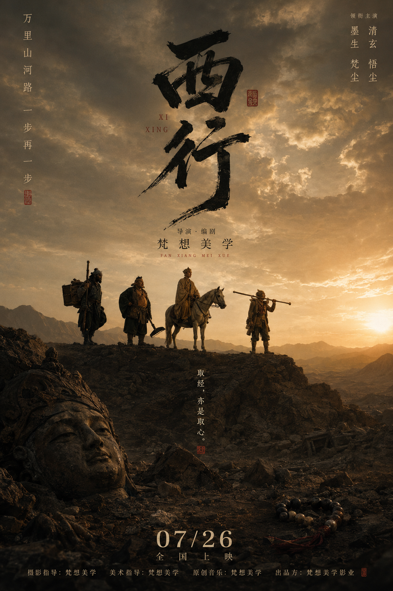
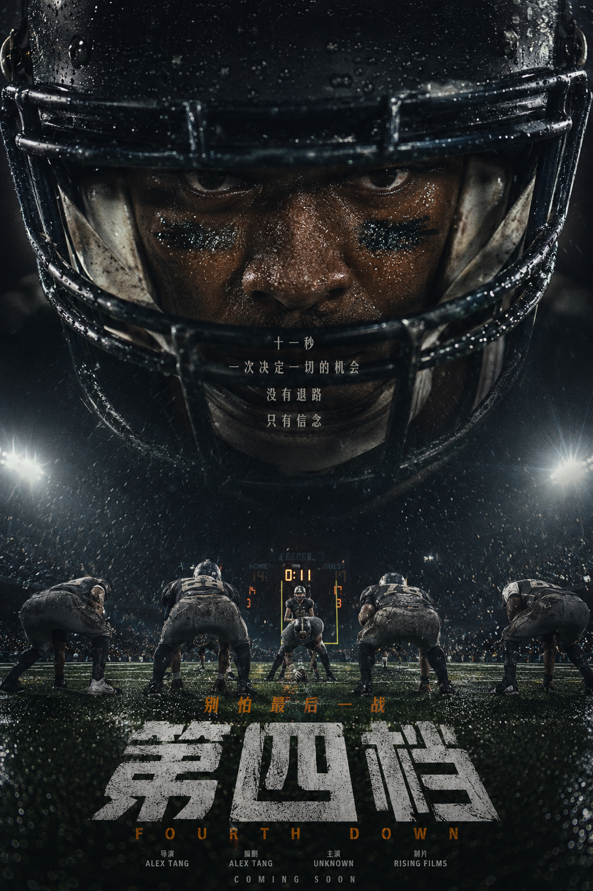
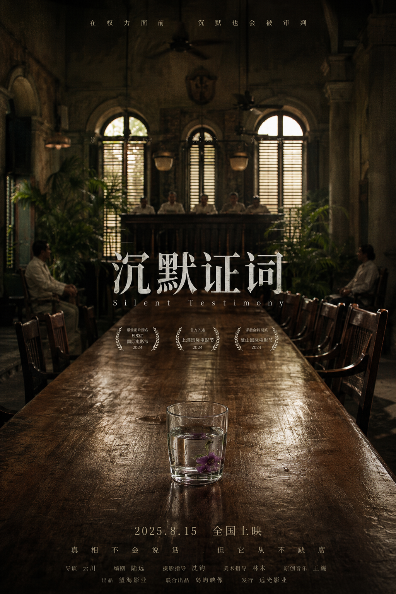
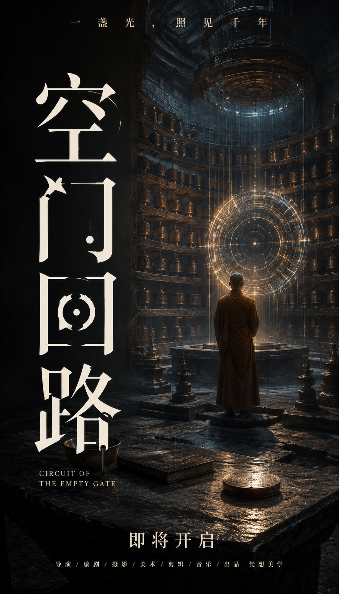

# Fantasy Movie Poster

**FANTASY / 梵想美学 · 电影与叙事**

从电影类型、故事冲突和视觉母题出发，分别设计底图与标题图层，再合成中文电影海报。

**[快速开始](#start)** · **[下载与安装](#install)** · **[完整规则](SKILL.md)** · **[全部视觉 Skills](https://github.com/dacnay816y62-hub?tab=repositories)**

| 视觉示例 01 | 视觉示例 02 |
| :---: | :---: |
|  |  |

<a id="start"></a>

## 一分钟开始

| 你提供 | 这套 Skill 组织的交付 |
| --- | --- |
| 故事、影片关键词、剧照或分镜参考 | 电影海报方案、底图与字体图层、合成结果 |

```text
用 $fantasy-movie-poster 为一个关于失物招领员的悬疑故事设计 9:16 中文电影海报。先明确视觉母题，再分别设计无字底图和标题图层，不加虚构奖项或媒体引语。
```

**生成说明：** Skill 组织设计判断、提示词与执行流程；图片由当前环境中可用的图像工具生成或编辑。示例用于理解视觉方向，具体来源以本仓库记录为准，不能据此保证每次得到相同效果。

<a id="install"></a>

## 下载与安装

**[下载当前分支 ZIP](https://github.com/dacnay816y62-hub/fantasy-movie-poster-skill/archive/refs/heads/main.zip)** · **[阅读 Skill 规则](SKILL.md)**

1. 下载并解压仓库。
2. 将仓库根目录（包含 `SKILL.md`）放入当前助手支持的技能目录。
3. 安装文件夹命名为 **`fantasy-movie-poster`**，确保入口是 `fantasy-movie-poster/SKILL.md`。
4. 在支持技能调用的会话中使用 **`$fantasy-movie-poster`**。如果列表未刷新，新开一个任务。

Codex CLI / IDE 的用户级目录是 `~/.agents/skills/`，项目级目录是 `.agents/skills/`；Windows 用户目录可写为 `%USERPROFILE%\.agents\skills\`。以 [OpenAI 官方安装说明](https://learn.chatgpt.com/docs/build-skills#where-codex-loads-local-skills) 为准。ChatGPT 与其他宿主请按各自的技能加载方式使用。

仓库名与调用名可能不同，以上以 `SKILL.md` 中的名称为准。安装不包含图像服务、账户或生成额度；实际出图取决于你使用的环境。

---

## What It Does

- 进行电影海报前置分析：类型、亚类型、受众、情绪温度、核心冲突、视觉母题。
- 根据参考图提取视觉 DNA，而不是机械复刻参考图。
- 支持 9:16 中文电影海报方案、提示词、质量检查和分层生成工作流。
- 支持“底图层 / 字体图层 / 网格合成”的可复用流程。
- 强制避免真实电影节桂冠、真实片商标识、随机媒体引语和无意义小字。
- 所有虚拟制作署名统一使用“梵想美学”。

## Layered Poster Workflow

默认推荐分层流程：

1. **LLM 前置分析**  
   先判断这是一部什么电影。尤其遇到三联参考图时，要判断它是合家欢动画、文艺悬疑、运动压力片、东方权谋、科幻隔离，还是其他类型。

2. **Base Layer**  
   生成或裁切无字底图。底图必须提供文字可以“附着”的物理表面，例如幕布、玻璃、墙面、天空、桌面、地面反射、门框、头盔、球场、物件表面。

3. **Typography Layer**  
   字体图层也由图像模型单独生成，不用本地普通文字排版冒充字体设计。中文主标题必须清晰可读。

4. **Grid Composite**  
   本地只做裁切、缩放、透明度、混合模式和网格定位，不重新打字。

## Important Rule

如果参考图明显是儿童 / 合家欢 / Pixar-like 动物 IP 气质，不要把它硬改成阴郁空场文艺片。可以高级化，但不能背叛影片类型承诺。应保留角色魅力、表演能量、温暖色彩和家庭观众可进入性。

如果不能一模一样复刻参考图，就不要做“像但不准”的中间态。要么精确复现，要么做清晰的主题衍射。

## Examples

| Literary | Epic | Sports |
| --- | --- | --- |
|  |  |  |

| Institutional | Suspense | Poster |
| --- | --- | --- |
|  |  |  |

## Repository Structure

```text
fantasy-movie-poster/
  SKILL.md
  manifest.json
  references/
    layered-cover-workflow.md
    genre-presets.md
    typography-system.md
    composition-models.md
    quality-control.md
  scripts/
    build_prompt.py
    composite_layers.py
    validate_project.py
    validate_poster_text.py
    validate_skill.py
  templates/
  assets/
  examples/
```

## Scripts

Composite a base layer and a typography layer:

```powershell
python scripts/composite_layers.py `
  --base path/to/base.png `
  --type path/to/type.png `
  --out path/to/composite.png `
  --grid-out path/to/grid.json `
  --canvas 1080x1920 `
  --type-box 0,0,1,1 `
  --mode screen `
  --opacity 0.95
```

Validate the skill package:

```powershell
python scripts/validate_skill.py
```

## Design Notes

- 默认画幅：9:16。
- 中文标题优先，英文副标题只做辅助节奏。
- 标题可以成为主视觉，占据 30%-60% 的画面，但必须服务叙事。
- 底图应低到中等对比，避免脏黑、重 HDR、恐怖片化和无意义颗粒。
- 不自动保留三联画结构，除非用户明确要求。

## License

Personal / experimental skill package. Add a formal license before public reuse if needed.

## FANTASY / 梵想美学

**让想象先被看见。** 将视觉判断与创作流程整理成可以继续使用的方法。

**[浏览全部视觉 Skills](https://github.com/dacnay816y62-hub?tab=repositories)** · [CINEMA DNA](https://github.com/dacnay816y62-hub/cinema-dna-21x9x3) · [Character Casting Studio](https://github.com/dacnay816y62-hub/character-casting-studio-skill)
