# Regional Culture Poster

**FANTASY / 梵想美学 · 文化海报与编辑设计**

从地方空间、材料与文化机制出发，设计结构造字海报或地域编辑海报。

**[快速开始](#start)** · **[下载与安装](#install)** · **[完整规则](SKILL.md)** · **[全部视觉 Skills](https://github.com/dacnay816y62-hub?tab=repositories)**

| 视觉示例 01 | 视觉示例 02 |
| :---: | :---: |
| 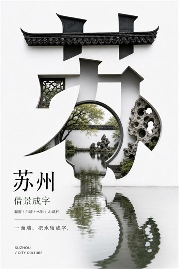 | 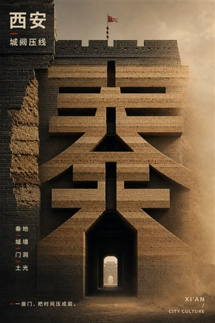 |

<a id="start"></a>

## 一分钟开始

| 你提供 | 这套 Skill 组织的交付 |
| --- | --- |
| 城市、县域、省域或文化区域 | 地域文化分析、字体图像关系与海报方向 |

```text
用 $regional-culture-poster 做泉州的地域文化海报，选择 MODE B。让红砖、骑楼与街巷空间承担识别，小字少一些，不做地标拼贴。
```

**生成说明：** Skill 组织设计判断、提示词与执行流程；图片由当前环境中可用的图像工具生成或编辑。示例用于理解视觉方向，具体来源以本仓库记录为准，不能据此保证每次得到相同效果。

<a id="install"></a>

## 下载与安装

**[下载当前分支 ZIP](https://github.com/dacnay816y62-hub/regional-culture-poster/archive/refs/heads/main.zip)** · **[阅读 Skill 规则](SKILL.md)**

1. 下载并解压仓库。
2. 将仓库根目录（包含 `SKILL.md`）放入当前助手支持的技能目录。
3. 安装文件夹命名为 **`regional-culture-poster`**，确保入口是 `regional-culture-poster/SKILL.md`。
4. 在支持技能调用的会话中使用 **`$regional-culture-poster`**。如果列表未刷新，新开一个任务。

Codex CLI / IDE 的用户级目录是 `~/.agents/skills/`，项目级目录是 `.agents/skills/`；Windows 用户目录可写为 `%USERPROFILE%\.agents\skills\`。以 [OpenAI 官方安装说明](https://learn.chatgpt.com/docs/build-skills#where-codex-loads-local-skills) 为准。ChatGPT 与其他宿主请按各自的技能加载方式使用。

仓库名与调用名可能不同，以上以 `SKILL.md` 中的名称为准。安装不包含图像服务、账户或生成额度；实际出图取决于你使用的环境。

---

## 定位

把中国地域文化转译成克制当代的大字海报与编辑海报。它不是旅游宣传模板，不以地标拼贴为核心，也不追求泛化的“国潮风”。

本仓库可作为 Codex skill 或 Claude Code skill 使用。只要宿主支持本地 skill 目录和 `SKILL.md` 约定，就可以安装。

更新记录见 [CHANGELOG.md](CHANGELOG.md)。

## 安装

### Codex

```bash
mkdir -p ~/.agents/skills
git clone https://github.com/dacnay816y62-hub/regional-culture-poster.git ~/.agents/skills/regional-culture-poster
```

如果你已经装过旧版：

```bash
cd ~/.agents/skills/regional-culture-poster
git pull
```

### Claude Code

```bash
mkdir -p ~/.claude/skills
git clone https://github.com/dacnay816y62-hub/regional-culture-poster.git ~/.claude/skills/regional-culture-poster
```

如果你已经装过旧版：

```bash
cd ~/.claude/skills/regional-culture-poster
git pull
```

### 使用

安装后，在对话中直接提到 skill 名即可：

```text
用 regional-culture-poster 做 10 个城市，直接图像生成，不要合成。
```

## 示例图例

以下图例用于展示 skill 的视觉方向与构图方法。示例资产的 `rights_status` 视为 `unknown`；请勿直接复制到正式商业项目中，商用请自行替换为自有、授权或可商用素材。

| 苏州 | 西安 | 成都 |
|---|---|---|
|  |  |  |

| 北京 | 长沙 | 大理 |
|---|---|---|
| 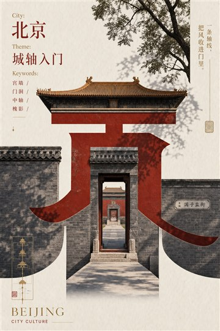 | 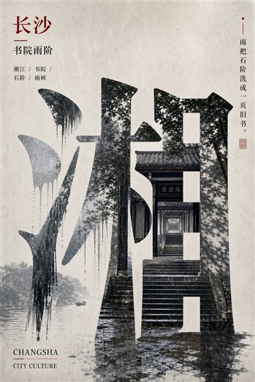 | 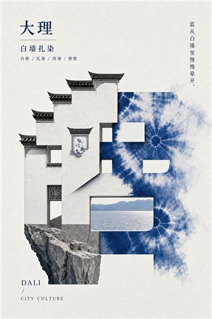 |

| 大连 | 重庆 | 佛山 |
|---|---|---|
| 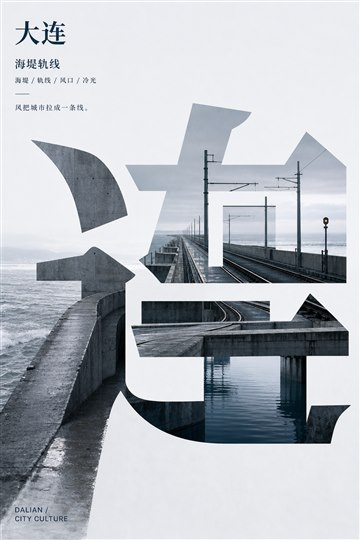 | 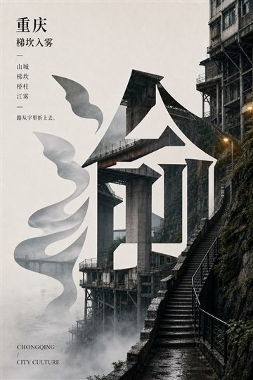 | 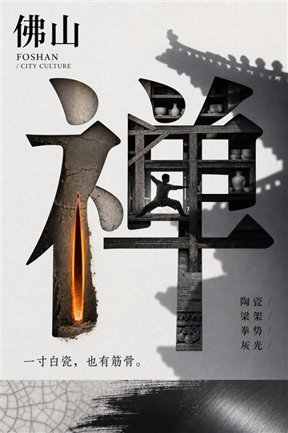 |

| 桂林 | 杭州 | 呼和浩特 |
|---|---|---|
| 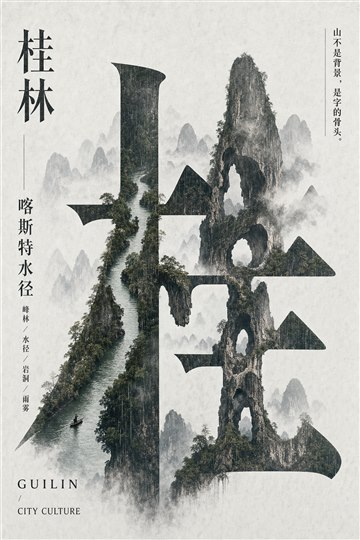 | 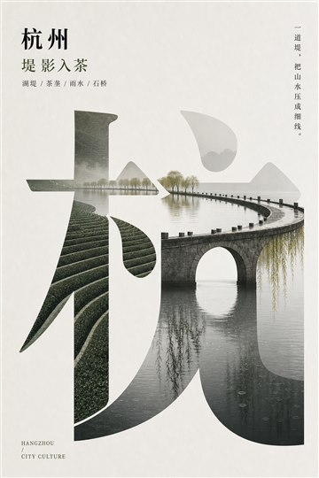 |  |

| 嘉兴红船 | 景德镇 | 绍兴 |
|---|---|---|
|  | 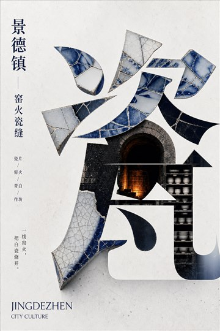 |  |

| 沈阳 | 昆明 | 贵阳 |
|---|---|---|
|  | 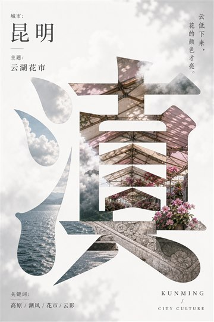 |  |

| 乌鲁木齐 | 上海 |
|---|---|
| 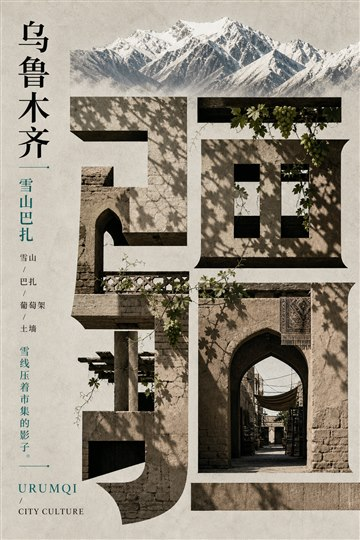 | 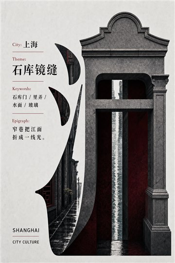 |

## 适合做什么

- 城市文化海报
- 省域 / 地域视觉系统
- 城市系列主视觉
- 展览 Key Visual
- 非旅游化的地域文化表达
- 公众号、小红书、封面、出版物视觉
- 直接图像生成，或先生成视觉基础后再进行确定性排版

## 两种模式

### MODE A：结构造字海报

汉字结构是主视觉。城市元素参与字形生长，适合“城市字体 / 大字 / 造字 / 一个主字”的方向。

### MODE B：地域编辑海报

城市空间是主视觉，城市名是编辑锚点。适合“杂志感 / 城市文化研究 / 图文层级 / 不只靠大字”的方向。

MODE B 不把整张照片裁进大字里，而是先判断城市文化，再推导空间原型、裁切边界、图文比例和地域化字体细节。

## 关键设计原则

### 1. 遮字后仍要能识别地域

如果把城市名、主题、关键词都遮掉，画面里仍应有至少一个不可替换的地方文化机制，例如：

- 重庆：山城梯坎、桥柱、吊脚空间、江雾
- 泉州：红砖燕尾脊、骑楼、海丝寺庙门廊
- 苏州：园林漏窗、白墙、水影、太湖石
- 嘉兴：红船、南湖、水院、粽叶
- 哈尔滨：冰砖、冬街、拱窗、雪光

玻璃、桥、水面、混凝土、雾、霓虹、天际线等通用现代元素只能辅助，不能单独作为地域文化证据。

### 2. 当代、不土、不旅游广告

默认避免：

- 旅游宣传海报
- 地标拼贴
- 民俗宣传板
- 非遗展板感
- 复古拓印
- 土黄旧墙
- 红金国潮模板
- 电影海报式城市夜景
- 商业地产 KV

优先使用：

- 冷灰、雾白、深绿黑、湿石、玻璃反射、金属边缝
- 局部红砖、木构、青瓷、冰蓝、湖绿等由地方材料自然带出的色彩
- 空间切口、门洞、廊柱、楼梯、桥墩、水面、墙体厚度、雨痕、阴影

### 3. 标题字体要有地域逻辑

不要只换字体。标题的变化应来自当地结构、材料、气候或空间原型，例如：

- 城墙 / 门洞带来的稳定骨架
- 桥梁 / 栈道带来的横向节奏
- 冰砖 / 陶瓷带来的局部切面
- 山脊 / 水岸带来的边界关系
- 骑楼 / 拱券带来的连续开口

字体可做 10–20% 的局部适配，但城市名必须保持可读。

## 生成方式

本 skill 不绑定任何单一图像模型或本机目录。可按当前宿主环境选择：

1. 直接生成：使用宿主提供的图像生成工具，生成完整扁平海报。
2. 分层生成：先生成视觉基础，再用确定性排版工具加入准确中文。
3. 仅输出 prompt：在没有图像工具时，输出可复制到其他工具的高质量提示词。

推荐画幅：竖版 3:4 或 2:3。具体尺寸、质量参数和保存目录应由使用者当前环境决定。

## 快速使用示例

```text
用 regional-culture-poster 做 10 个城市，直接图像生成，不要合成。
```

```text
做嘉兴，加入：红船启航地，嘉兴醉江南。
```

```text
南京这张看不懂，完整写上南京，但保持创意。
```

## 典型工作流

1. 分析地域文化候选池：地理气候、建筑结构、材料颜色、历史文学、日常生活、当代状态、精神气质。
2. 选定一个不可替换的地方机制：例如“红船 + 南湖 + 水院 + 粽叶”，而不是泛泛的“江南水乡”。
3. 选择主字或完整地名：单字优先，完整地名作为可读性 fallback。
4. 写成生成 prompt：包含主字、文化结构、版式、色彩、精确文案、负面约束。
5. 生成或排版：根据宿主能力选择直接生成或分层生产。
6. 做遮字识别检查：如果遮掉文字后只剩通用城市材料，重写方向。

## 文件结构

```text
regional-culture-poster/
├── SKILL.md
├── README.md
├── LICENSE
├── CHANGELOG.md
├── agents/
│   └── openai.yaml
├── references/
│   ├── cultural-analysis.md
│   ├── direct-generation.md
│   ├── production.md
│   ├── series-and-examples.md
│   ├── mode-b-editorial.md
│   └── visual-system.md
└── assets/
    └── examples/
```

## 参考文件

- `SKILL.md`：主流程、路由规则、默认行为、校验门槛
- `references/cultural-analysis.md`：文化分析维度与反刻板印象
- `references/visual-system.md`：构图、字形、材料、色彩、禁忌
- `references/direct-generation.md`：直接生成模式的 prompt 结构
- `references/mode-b-editorial.md`：地域编辑海报模式
- `references/production.md`：生产模式选择
- `references/series-and-examples.md`：系列化去重与案例逻辑

## 许可证

代码、文档与 skill 规则以 [MIT License](LICENSE) 发布。示例图片仅用于展示视觉方向，权利状态为 `unknown`，正式商用前请替换为自有或已授权资产。

## 维护重点

1. 提高“遮字后地域识别”的强度。
2. 避免从“土味”过度修正成“通用商业 KV”。
3. 保持字形和文化机制的空间碰撞，而不是退回普通地名海报。
4. 公开发布前必须脱敏：不要提交本机路径、个人目录、临时文件、API 配置、聊天截图、未授权素材或具体私有模型网关信息。

## FANTASY / 梵想美学

**让想象先被看见。** 将视觉判断与创作流程整理成可以继续使用的方法。

**[浏览全部视觉 Skills](https://github.com/dacnay816y62-hub?tab=repositories)** · [东方文化编辑海报](https://github.com/dacnay816y62-hub/fantasy-dongfang-jianyuehaibao) · [Chinese Poster Skill](https://github.com/dacnay816y62-hub/chinese-poster-skill)
